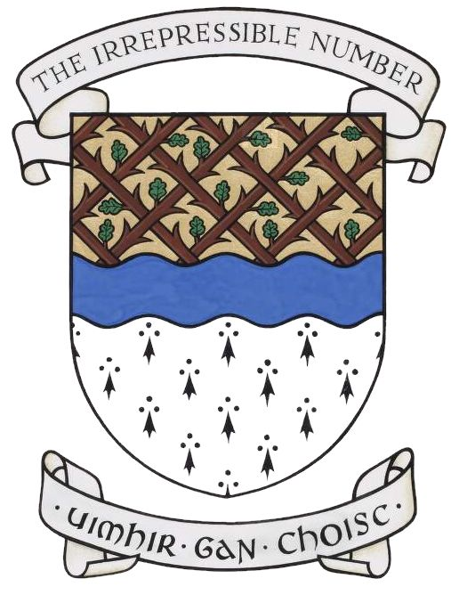

- fun unusual variation of the field- [fretty of blackthorn branches leaved proper](https://www.reddit.com/r/heraldry/comments/dkcic9/arms_of_muine_bheag_in_county_carlow_ireland/) (arms of Muine Bheag) #heraldry
	- {:height 365, :width 272}
- _nice_ hand-drawn variant for [these arms](https://www.reddit.com/r/heraldry/comments/17j8dnk/creating_vector_and_a_more_drawn_version/) #heraldry
- working on [[my assumed arms]] #heraldry