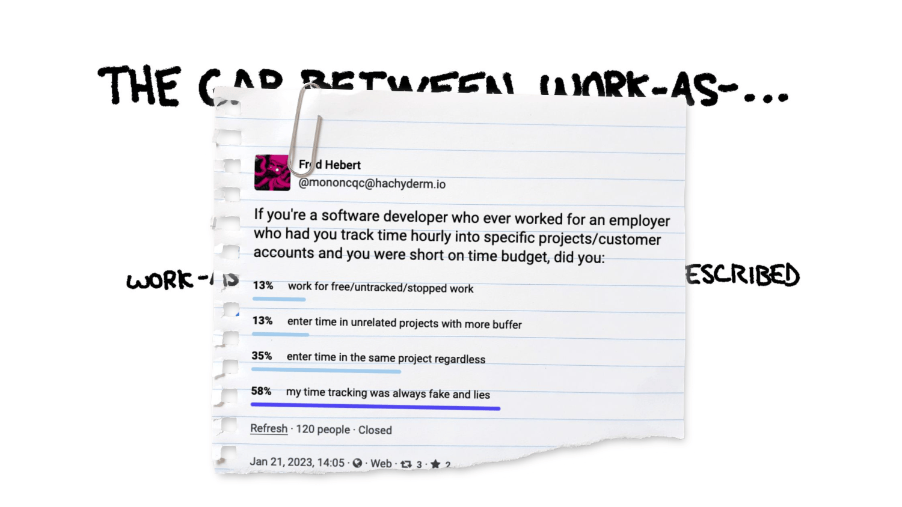

- the arms of the [University of Auckland](https://www.reddit.com/r/heraldry/comments/17u0x00/arms_of_the_university_of_auckland/) are quite good #heraldry
	- {:height 328, :width 299}
- Matt Levine on [the probabilistic billionaire](https://newsletterhunt.com/emails/41687) and [why WeWork gets a second chance](https://newsletterhunt.com/emails/41956) #business
- via SRE Weekly:
	- [Optimism and Pessimism in Distributed Systems](https://brooker.co.za/blog/2023/10/18/optimism.html) #distsys
	- [A guide to running Incident Command](https://argoday.medium.com/incident-command-guide-9872b51d7c94) #SRE #devops
- [Embrace complexity, tighten your feedback loops](https://ferd.ca/embrace-complexity-tighten-your-feedback-loops.html). fun read on perceived vs. actual structure and processes of an org #management #sociology #[[engineering management]]
	- ref: [ferd's notes](https://ferd.ca/notes/paper-moving-off-the-map.html), original paper [Moving off the map](https://pubsonline.informs.org/doi/abs/10.1287/orsc.2018.1277) (Huising 2019)
	- the Fatal Insight:
		- > organizations and institutions exist only in actual people’s doings and that these are necessarily particular, local and ephemeral
		- > social worlds do not have an independent, stable existence but instead emerge from our collective action
		- > Within the system of roles, rules, and routines, there is far more room to maneuver than previously assumed.
	- this can cause a feedback loop of misunderstanding where work-as-imagined gets farther and farther away from work-as-actually-done, e.g.:
		- 