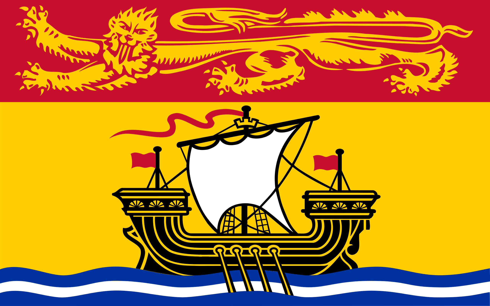

- via Reddit: [riffing on Minnesota's new flag, a full heraldic achievement](https://www.reddit.com/r/heraldry/comments/18o9kww/minnesotas_new_flag_is_technically_heraldically/) #heraldry #vexillology
- somehow, I had never seen the [Flag of New Brunswick](https://en.wikipedia.org/wiki/Flag_of_New_Brunswick), but now it's a new favorite! it has a delightfully medieval/heraldic feel #vexillology
	- {:height 258, :width 400}