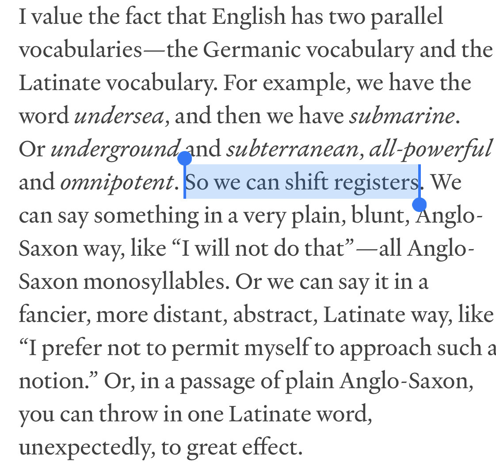

- up on a new device- Razer Blade 15 this time
	- nice screen, good specs, nicer form factor than the ol' Thinkpad
	- ...machine heats up real quick though. don't love that 🤔
- [via Tumblr](https://bngrc.tumblr.com/post/738837343774097408/this-funny-thing-happens-when-you-try-to-translate), fun facts on registers in English #linguistics #english
	- {:height 360, :width 359}
	- > *The simultaneous borrowing of French and Latin words led to a highly distinctive feature of modern English vocabulary: sets of three items, all expressing the same fundamental notion but differing slightly in meaning or style, e.g., kingly, royal, regal; rise, mount, ascend; ask, question, interrogate; fast, firm, secure; holy, sacred, consecrated. The Old English word (the first in each triplet) is the most colloquial, the French (the second) is more literary, and the Latin word (the last) more learned.”*
	  (Howard Jackson and Etienne Zé Amvela, “Words, Meaning and Vocabulary: An Introduction to Modern English Lexicology.” Continuum, 2000)
	- > *But language tends not to do what we want it to. The die was cast: English had thousands of new words competing with native English words for the same things. One result was triplets allowing us to express ideas with varying degrees of formality. **Help** is English, **aid** is French, **assist** is Latin. Or, **kingly** is English, **royal** is French, **regal** is Latin – note how one imagines posture improving with each level: **kingly** sounds almost mocking, **regal** is straight-backed like a throne, **royal** is somewhere in the middle, a worthy but fallible monarch.*
	  McWhorter, [English Is Not Normal](https://aeon.co/essays/why-is-english-so-weirdly-different-from-other-languages) #linguistics #medieval #history
- started going through Mark Richards' [[Software Architecture Monday]]- learning some useful tips about distributed logging! #[[software architecture]]
- [Task Contamination: Language Models May Not Be Few-Shot Anymore](https://arxiv.org/abs/2312.16337) #ml
- putting new speakers through their paces by listening to one of the hottest bangers of the 16th century: [Thomas Tallis - "Spem in Alium"](https://www.youtube.com/watch?v=iT-ZAAi4UQQ) #music #choral #Renaissance #classical #Tallis
- via [[Matthew Butterick]], [LIGATURES IN PROGRAMMING FONTS: HELL NO](https://practicaltypography.com/ligatures-in-programming-fonts-hell-no.html) #typography #[[software engineering]]
	- I agree wholeheartedly- nice to see I'm not the only one, and that there are decent typographic _reasons_ to think so as well
- *finally* got this here digital garden [up on Github](https://github.com/vivshaw/zettel/tree/main)! #[[digital garden]] #personal
	- still gotta figure out a hosting solution, though!