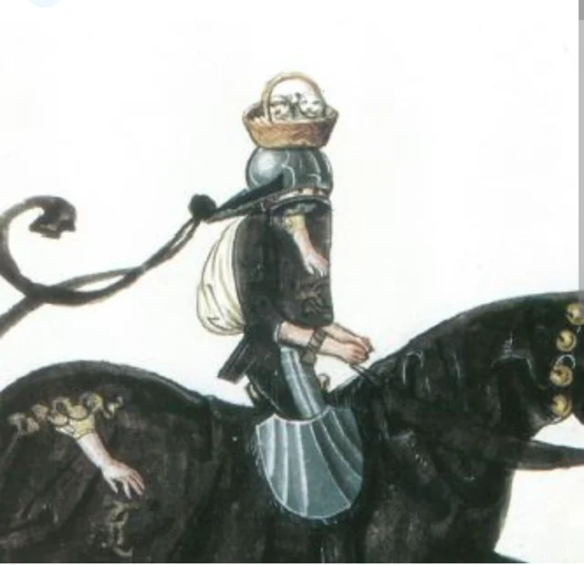

- via Philosophy Break: Iris Murdoch: ["Unselfing" is Crucial for Living a Good Life](https://philosophybreak.com/articles/iris-murdoch-unselfing-is-crucial-for-living-a-good-life/) #[[Iris Murdoch]] #philosophy #nature #ethics
	- > Beauty is the convenient and traditional name of something which art and nature share, and which gives a fairly clear sense to the idea of quality of experience and change of consciousness. I am looking out of my window in an anxious and resentful state of mind, oblivious of my surroundings, brooding perhaps on some damage done to my prestige. Then suddenly I observe a hovering kestrel. In a moment everything is altered. The brooding self with its hurt vanity has disappeared. There is nothing now but kestrel. And when I return to thinking of the other matter it seems less important. And of course this is something which we may also do deliberately: give attention to nature in order to clear our minds of selfish care.
	  [...]
	  A self-directed enjoyment of nature seems to me to be something forced. More naturally, as well as more properly, we take a self-forgetful pleasure in the sheer alien pointless independent existence of animals, birds, stones and trees.
	  (Iris Murdoch, *The Sovereignty of Good*)
		- interesting parallels with [[anatta]]!
	- > The self, the place where we live, is a place of illusion. Goodness is connected with the attempt to see the unself, to see and to respond to the real world in the light of a virtuous consciousness. This is the non-metaphysical meaning of the idea of transcendence to which philosophers have so constantly resorted in their explanations of goodness. “Good is a transcendent reality” means that virtue is the attempt to pierce the veil of selfish consciousness and join the world as it really is.
	  (Iris Murdoch, *The Sovereignty of Good*)
		- a return to a [[Platonic]] idea of "the Good" as a Form
- via Reddit, one of the more unusual heraldic crests: [a basket of kittens, for Gasper Laremberg](https://www.reddit.com/r/heraldry/comments/1976w59/the_strange_crest_of_the_german_knight_gasper/) #heraldry
	- {:height 420, :width 423}