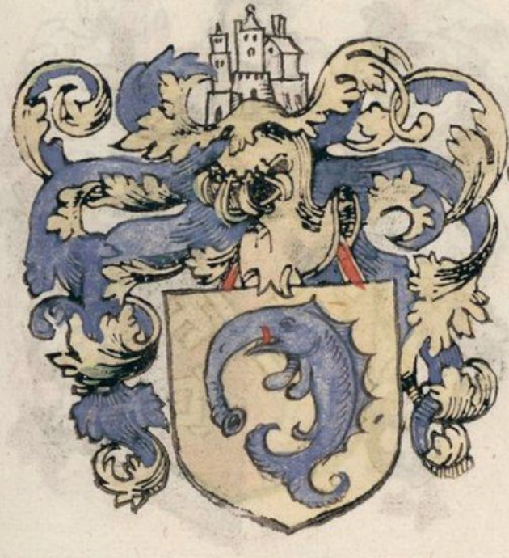

- via r/heraldry, [an unusual heraldic charge](https://www.reddit.com/r/heraldry/comments/1aji6o8/who_can_come_up_with_an_original_name_for_this/)... allegedly a dolphin? #heraldry #weirdmedievalguys
	- {:height 497, :width 446}