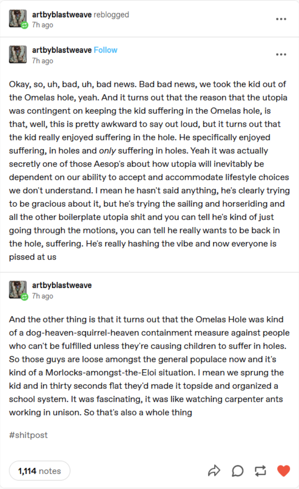

- Aeon on [Ant Geopolitics](https://aeon.co/essays/the-strange-and-turbulent-global-world-of-ant-geopolitics) - unicolonial species, globalization, insect warfare, and the anthropomorphization of arthropods #geopolitics #biology #ecology
	- fire ants have made it to [[Sicily]]!
- [Imagining Yourself in Another's Shoes vs. Extending Your Concern: Empirical and Ethical Differences](https://schwitzsplinters.blogspot.com/2024/01/imagining-yourself-in-anothers-shoes-vs.html) #ethics #altruism
	- and empirical evidence on [which philosophical arguments convince folks to give to charity](https://schwitzsplinters.blogspot.com/2020/06/contest-winner-philosophical-argument.html), and [why/what features they have](https://schwitzsplinters.blogspot.com/2024/02/what-types-of-argument-convince-people.html)
	- it is interesting that appeals to self-interested reasons to give were uniquely _ineffective_! it seems that perhaps, appealing to selfishness just encourages people to be more selfish, _even when being more altruistic would benefit them_! human selfishness thus being rather distinct from rational self-interest
- [more bad news from the Omelas hole](https://www.reddit.com/media?url=https%3A%2F%2Fi.redd.it%2Fnard2vajqbjc1.png) #sci-fi #[[political philosophy]] #[[The Ones Who Walk Away from Omelas]]
	- {:height 635, :width 384}