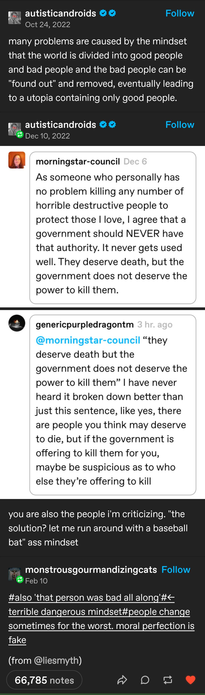

- [I Peered Into the Mysteries of the Universe and Found Only More Mysteries](https://archive.is/Snvy9#selection-655.0-655.73) - on the role of direct human experience in science, and a new [[phenomenology]]-based [[philosophy of science]]
- Noah Smith on [why Japanese cities are nice to live in](https://www.noahpinion.blog/p/why-japanese-cities-are-such-nice) #architecture #[[urban planning]] #urbanism #Japan
- tumblr on the flaws of the [[good people theory]] of morality:
	- {:height 1150, :width 341}