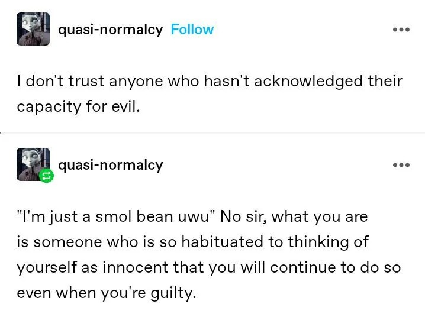

- more heat from Tumblr on practical ethics and the human capacity for evil #ethics #evil
	- {:height 289, :width 377}
- Matt Lakeman's [notes on El Salvador](https://mattlakeman.org/2024/03/30/notes-on-el-salvador/) fills in some fascinating details on recent history. why was the murder rate so high, and why is it now so low? how did [[Bukele]] get so wildly popular? is El Salvador still a democracy? what about all that weird [[bitcoin]] stuff? Lakeman has some theories. #geopolitics #economics #[[El Salvador]] #law
- on the genesis of [[Mary's Room]]: [Leibniz, Ibn Tufayl and the pre-history of a famous thought experiment anew](https://digressionsimpressions.substack.com/p/leibniz-ibn-tufayl-and-the-pre-history) #philosophy #[[philosophy of mind]] #[[thought experiments]]
	- [[ibn Tufayl]]'s example is of a man blind from birth, who later gains sight. would he understand that what he sees is the same as what he has learned through his other senses? ibn Tufayl says yes!
		- [[William Molyneux]] would later put forth [[Molyneux's problem]] to [[Locke]], about just the same thing
		- and even later, we'd empirically disconfirm this via cataract restoration. [[Oliver Sacks]] writes about this, as does [this New Yorker article](https://www.newyorker.com/tech/annals-of-technology/people-cured-blindness-see). turns out building a healthy visual sense takes time.
	- [[Leibniz]]'s example is of a cold-blooded man from a land with no warmth, who first experiences fire. would he know what it was? Leibniz says not at first, but at length, he'd learn.
- Justin Smith-Ruiu on [the current anti-historicist wave in philsophy and the philistinism of effective altruism](https://www.the-hinternet.com/p/neo-utilitarians-are-utter-philistines) #[[philosophy of history]] #[[history of philosophy]] #philosophy #ethics #[[effective altriusm]]