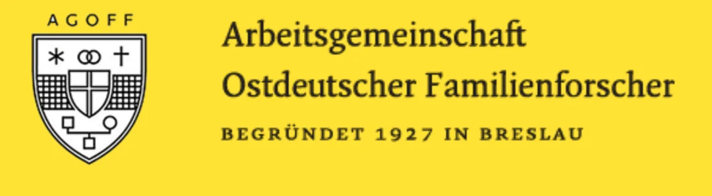

- [[sick]] arms for the East German Family Research Working Group, incorporating genealogical symbols as charges! #heraldry #genealogy #Germany #[[East Germany]]
	- {:height 174, :width 656}
- LLM-based response models trained on an individual's writing [catching on in philosophy](https://dailynous.com/2024/04/17/say-hello-to-this-philosophers-extra/). now with a suggestion of a name for this type of thing: "ExTRA" ("Extended Thought and Response Agent") #LLM #AI #philosophy