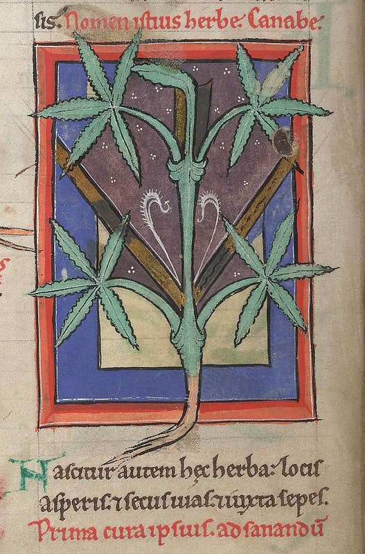
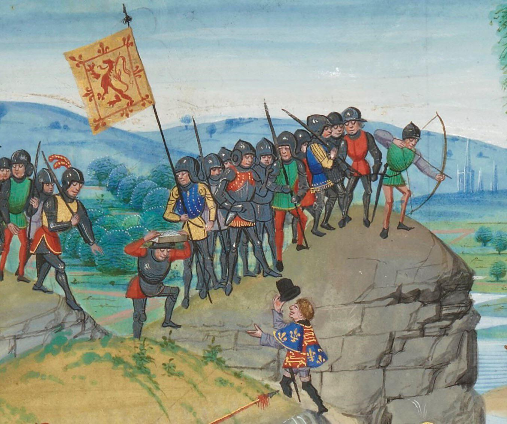
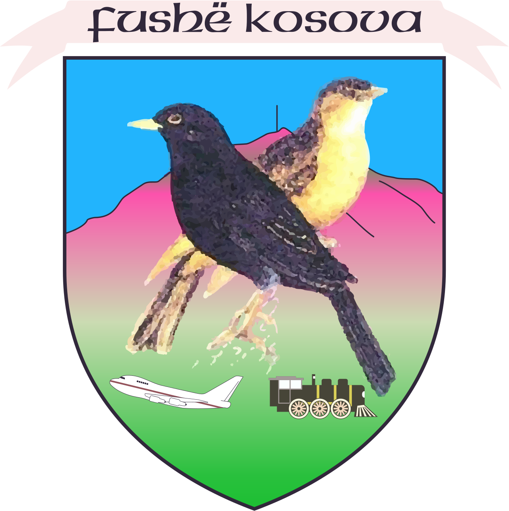
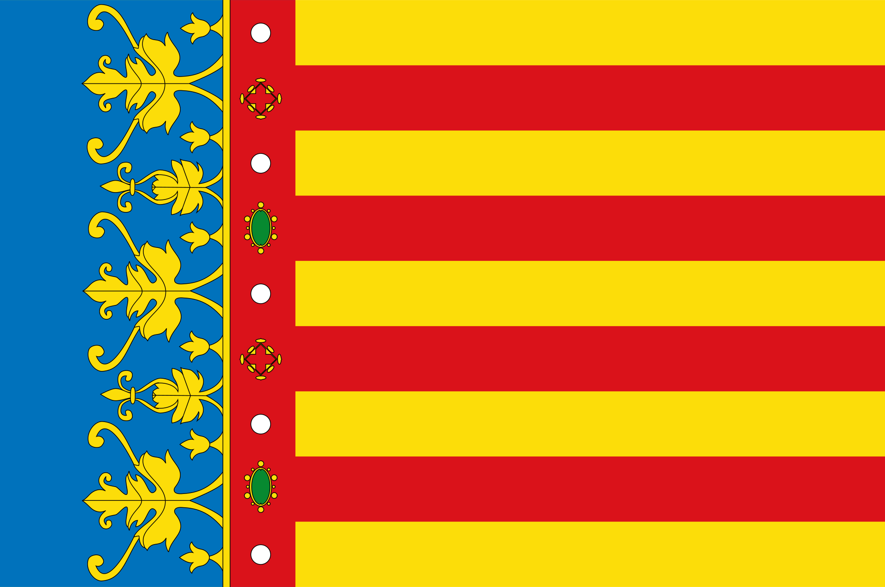

- interesting medieval illumination finds of the weekend: #art #medieval #medicine
	- [courtesy Public Domain Archive](https://publicdomainreview.org/collection/miniatures-from-a-12th-century-medical-and-herbal-collection/), medieval medical marijuana (among many other interesting medical and herbalist illuminations)
		- {:height 355, :width 229}
	- courtesy Reddit, a medieval tophat!
		- {:height 307, :width 355}
- introducing, the... *alarming* arms of Fushe Kosova #heraldry #Kosovo #airplanes #trains
	- {:height 352, :width 326}
- somehow, I had never seen Valencia's *gorgeous* *Reial Sanyera* #vexillology #Valencia #Spain
	- {:height 276, :width 405}