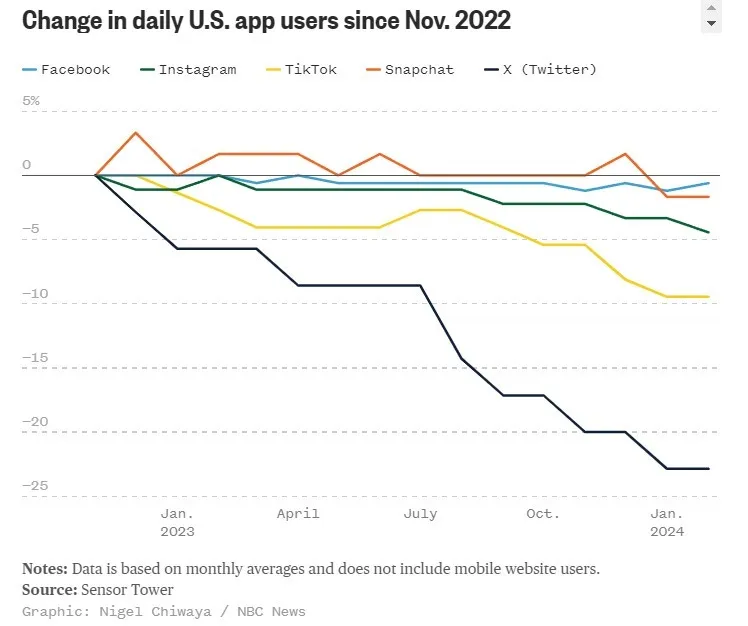

- ACOUP on [the Imperial Star Destroyer](https://acoup.blog/2024/05/10/fireside-friday-may-10-2024/), and how Star Wars is like the end of the HOly Roman Empire and the consolidation of Germant #[[Star Wars]] #sci-fi #history #Germany #HRE #Vietnam
- a busy day for the teleology of internet culture: #internet #[[social media]] #culture #sociology
	- Noah Smith on [the death (again) of the Internet as we know it](https://www.noahpinion.blog/p/the-death-again-of-the-internet-as)- on how enshittification, the rebirth of push media, disinformation engines, and AI slop are maybe ending the social media era
		- {:height 364, :width 425}
	- from Nature, [Persistent interaction patterns across social media platforms and over time](https://www.nature.com/articles/s41586-024-07229-y) - the first study I know of to quantify the [[Eternal September]] effect!
	- contrariwise, Ruxandra Teslo holds that [Autism & the Internet will defeat the Monoculture](https://www.writingruxandrabio.com/p/autism-and-the-internet-will-defeat)
- DeepMind's latest foray: [Accurate structure prediction of biomolecular interactions with AlphaFold 3](https://www.nature.com/articles/s41586-024-07487-w) #biology #AI #[[machine learning]] #[[protein folding]] #chemistry
- via Eric Schwitzgebel, [Formal Decision Theory Is an Optional Tool That Breaks When Values are Huge](https://schwitzsplinters.blogspot.com/2024/05/formal-decision-theory-is-optional-tool.html) #philosophy #rationality #[[effective altriusm]] #[[Pascal's wager]] #[[decision theory]]
	- > Formal decision theory is a tool -- a tool that breaks, a tool we can do without, a tool we optionally deploy and can sometimes choose to violate without irrationality.  If it leads to paradox or bad results, we can say "so much the worse for formal decision theory", moving on without it, as of course humans have done for almost all of their history.
- Samuel Hammonds [95 theses on AI](https://www.secondbest.ca/p/ninety-five-theses-on-ai) #AI #[[machine learning]]
- Daily Nous on [teaching philosophy through non-linguistic media](https://dailynous.com/2024/05/07/teaching-philosophy-with-non-linguistic-media/) #philosophy #pedagogy #learning
- [Folterkammer](https://centurymedia.bandcamp.com/album/weibermacht), the opera black metal you didn't know you needed #opera #[[black metal]] #metal #music