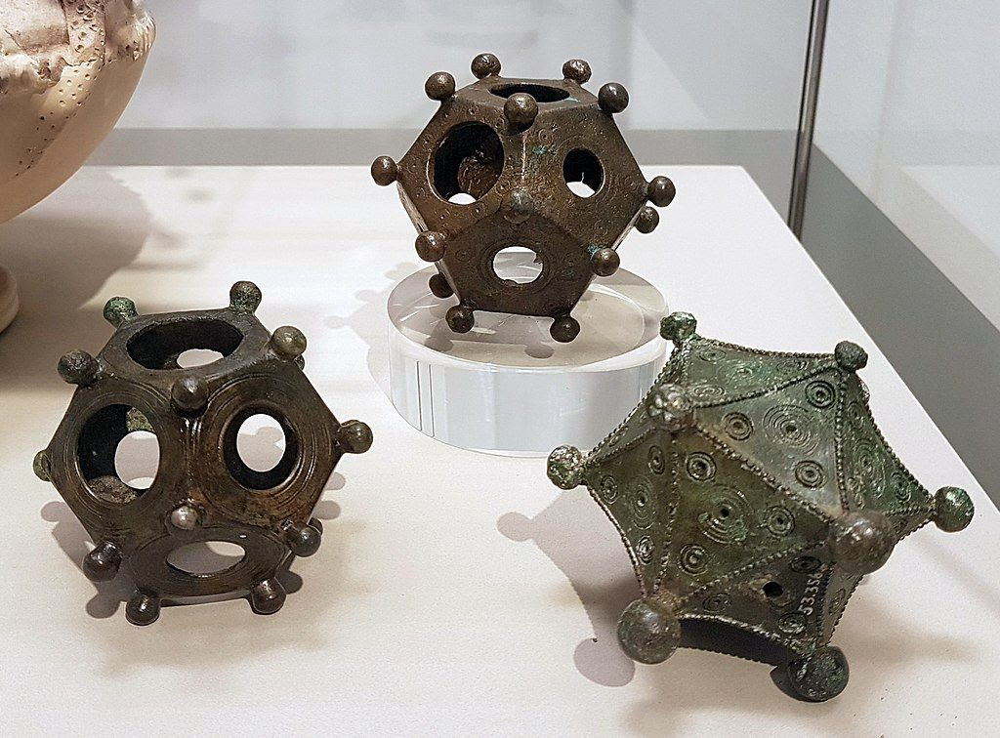

- LanguageLog on [the Roman dodecahedra](https://languagelog.ldc.upenn.edu/nll/?p=63770), some of the stranger historical artifacts of the Romans- with no known purpose and no extant description or depiction! #archaeology #history #Rome
	- {:height 256, :width 333}
	- [Part 2](https://languagelog.ldc.upenn.edu/nll/?p=63960) #Taoism #Zodiac #qi #mindfulness #breathwork
- [GPT-4o is live](https://openai.com/index/hello-gpt-4o/), a multi-modal evolution of GPT with impressive capability to handle audio, text, and vision. #OpenAI #AI #LLM