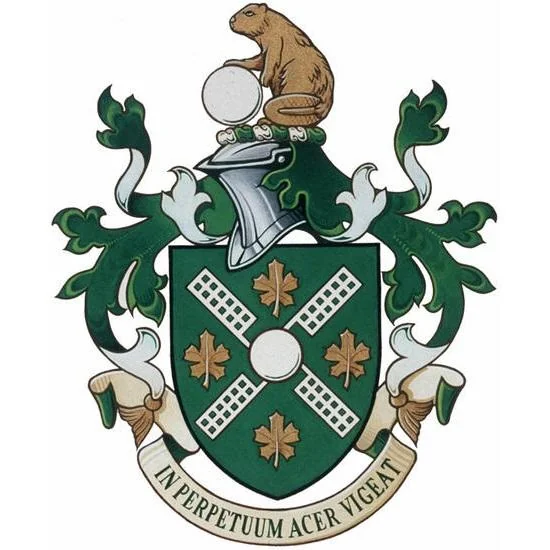

- [[Precious Plastic]], the DIY grassroots plastic recycling network, with machine plans! #recycling #environmentalism #plastics #engineering #DIY
- via Dekker, [why do things go right](https://safetydifferently.com/why-do-things-go-right/)? #safety #reliability #[[resilience engineering]]
- via /r/heraldry, [the arms of the Canadian Association of New York](https://www.reddit.com/r/heraldry/comments/1dsk1xs/the_arms_and_flag_of_the_canadian_association_of/), which might be the only American entity to have a grant of arms from the Canadian Heraldic Authority #heraldry #Canada #[[New York]]
	- {:height 337, :width 329}