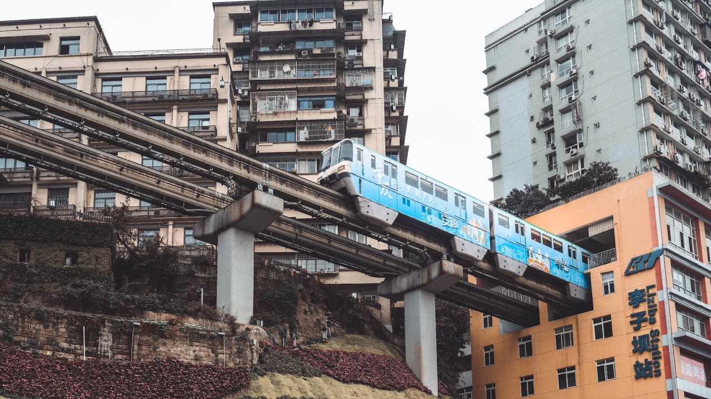
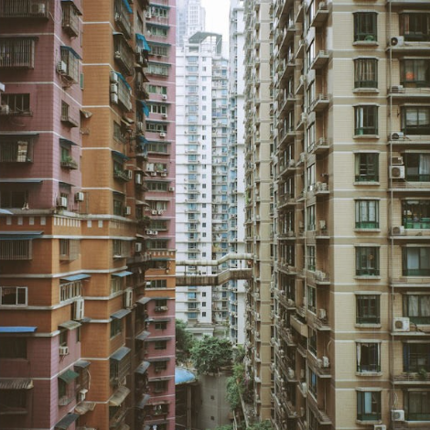
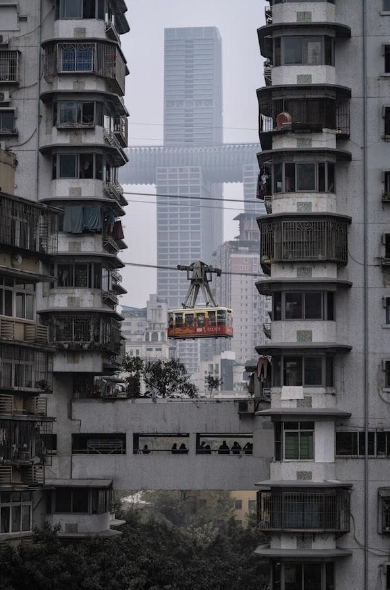
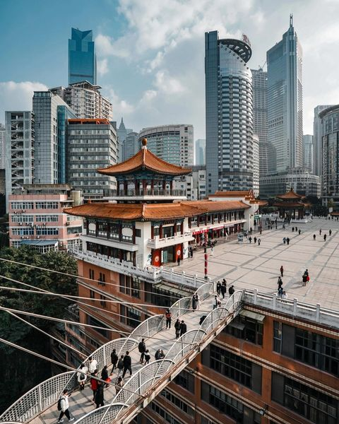
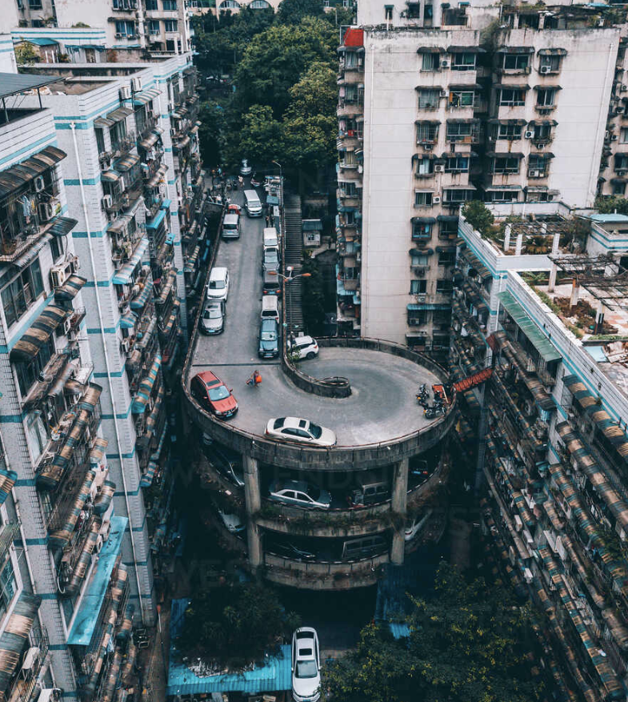

- [the tunic of Alexander the Great may have been discovered](https://phys.org/news/2024-10-tunic-royal-tombs-vergina-alexander.html) #archaeology #Greece #history #ancient
- the uniquely vertical urbanism of Chongqing #China #urbanism #architecture
	- [which floor is the ground floor?](https://www.reddit.com/r/BeAmazed/comments/180qtuf/which_floor_is_the_ground_floor_in_chongqing_china/)
	- [the endless stair climb back home](https://www.reddit.com/r/Damnthatsinteresting/comments/1atl5ae/endless_steps_in_chongqing/)
	- [how many steps from the subway exit to the street?](https://www.reddit.com/r/Damnthatsinteresting/comments/16cwo6e/the_amount_of_walking_required_in_chongqings/)
	- [why is commuting to work so hard?](https://www.reddit.com/r/interestingasfuck/comments/1g162cg/a_man_shows_his_commute_to_work_in_chongqing/)
	- [how deep does the commute go?](https://www.reddit.com/r/Damnthatsinteresting/comments/1gi71ve/this_gentleman_in_chongqing_china_shows_how_far/)
	- trains go through residential buildings!
		- 
	- ultra verticality!
		- 
	- aerial tramways!
		- 
	- public squares at 22 stories!
		- 
	- a multi-layer spiral road!
		- {:height 546, :width 480}