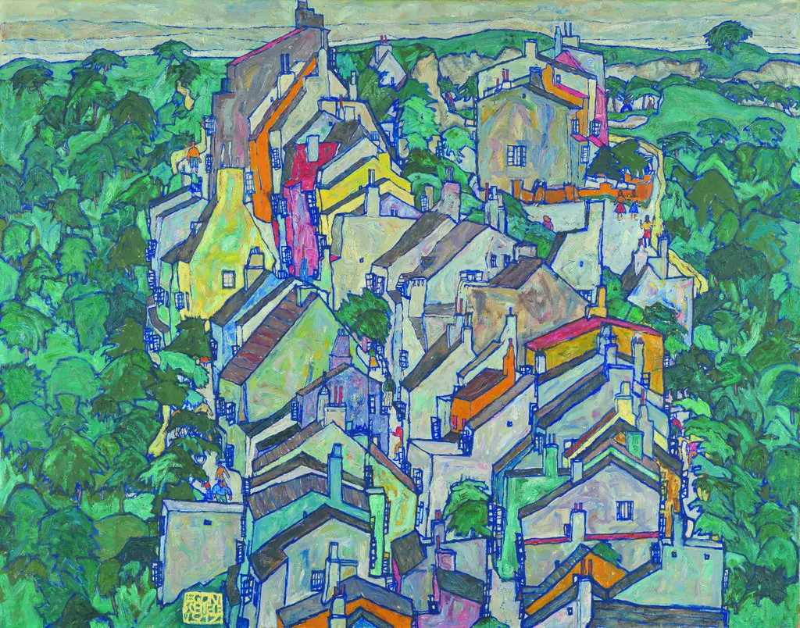

- Lorin Hochstein on [TTR: the out-of-control metric](https://surfingcomplexity.blog/2024/11/23/ttr-the-out-of-control-metric/) #TTR #SRE #DORA #[[statistical control]]
- Aeon on [Thomas Merton and "compassionate time"](https://aeon.co/essays/how-thomas-merton-both-loved-and-kept-his-distance-from-the-world) #biography #monasticism #Asia #Merton #asceticism #Buddhism #Christianity
- NYT on [Egon Schiele's hidden obsessions laid bare](https://www.nytimes.com/2024/11/21/arts/design/egon-schiele-landscapes-neue-galerie.html) - landscapes! #Schiele #art #landscape
	- {:height 406, :width 504}