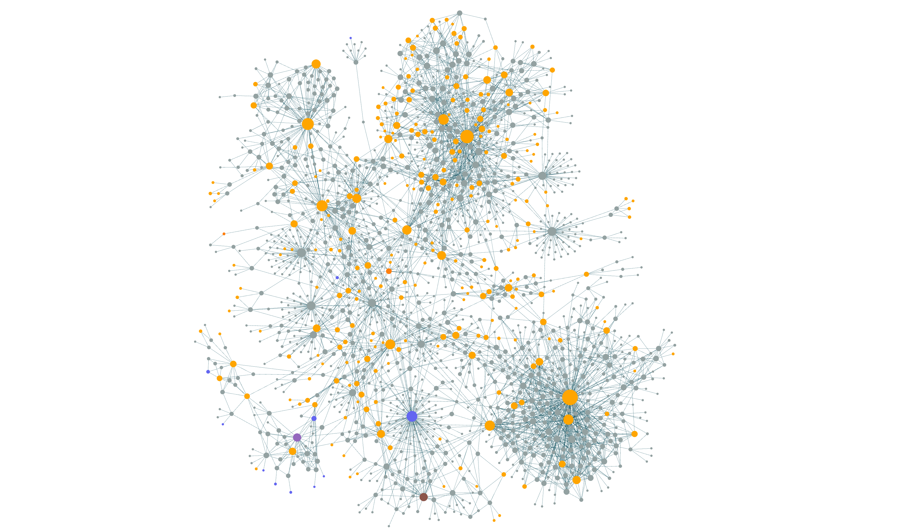

- [Houyhnhnm Computing](https://ngnghm.github.io/index.html) - an surprising exploration of how computing *could* have been different, in the form of extended fiction about dialog with sentient horse-people #OS #[[software engineering]] #[[software architecture]] #persistence #[[complex systems]] #[[computer engineering]]
	- yet another thing with shades of #Unison, as well as #Urbit
	- I'll work through this one in detail! [[Houyhnhnm Computing]]
- from SRE Weekly: #SRE #[[software engineering]]
	- Cloudflare [begins using formal verification](https://blog.cloudflare.com/topaz-policy-engine-design/) for internal DNS behavior, using a custom in-house Lispy lang (Topaz) and a #Racket-based model checker #lisp #[[formal verification]]
	- [Netflix on distributed counting](https://netflixtechblog.com/netflixs-distributed-counter-abstraction-8d0c45eb66b2) #distsys #caching
	- [Ably on message ordering at scale](https://ably.com/blog/chat-architecture-reliable-message-ordering) #distsys #time
	- Luc van Donkersgoed on [making AWS News stupid fast with smart caching](https://lucvandonkersgoed.com/2024/11/16/making-aws-news-stupid-fast-with-smart-caching/) #caching
- Anthropic [launches the Model Context Protocol](https://www.anthropic.com/news/model-context-protocol), an attempt at an open protocol for connecting AI assistants to arbitrary data sources #AI #Anthropic #[[AI assistant]] #data
- a snapshot of my digital garden as of today:
	- {:height 334, :width 566}
	- you can see distinct "lobes" forming!
		- the dense cluster in the top right is #philosophy and #theology, and the dense cluster in the bottom right is #ml and #stats.
		- the sparser cluster in the top left is #economics and #finance, transitioning into #management toward the core.
		- the sparse cluster in the bottom left through the bottom center is, from the left #linux and #networking, moving into #cloud, moving into #distsys and #db. there is surprisingly little interlinkage between cloud and distsys!
		- all the nodes surrounded by many little nodes are books, which appear to have an incredibly outsized influence on my notes.
		- the most central node appears to be #books, followed by #[[software engineering]], #psychology, #design, and #[[engineering management]] in that order. that's not too surprising, for a bibliomaniac with a career in management and a deep interest in #HCI.