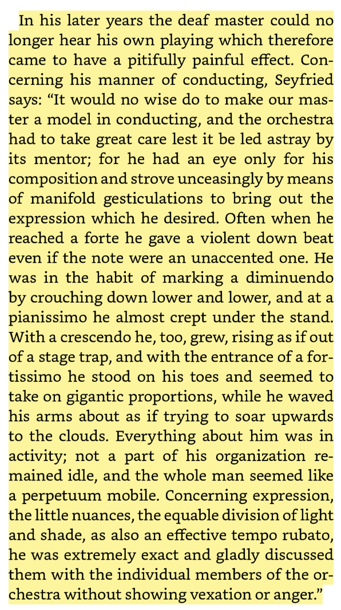

- on Beethoven's conducting style: #classical #music #Beethoven
	- {:height 729, :width 404}
- [Many worlds, many selves](https://aeon.co/essays/why-identity-morality-and-faith-splinter-in-the-multiverse) - if the many-worlds interpretation were true, what would that mean for philosophy of religion? #[[philsophy of religion]] #physics #multiverse #quantum #[[personal identity]] #ethics
- via Alice Evans, [Can Architecture Reveal the Spread of Purdah?](https://www.ggd.world/p/can-architecture-reveal-the-spread) we can trace the practice of women's seclusion in India by following the spread of Mughal architecture #architecture #feminism #India #Mughal #Bangladesh #Islam #Hinduism
	- see also: [Can Big Data Reveal the Origins of Purdah?](https://www.ggd.world/p/can-big-data-reveal-the-origins-of) #data
- John Baez on [compact multi-planetary systems](https://johncarlosbaez.wordpress.com/2024/11/29/compact-multi-planet-systems/) - many solar systems display a surprising regularity in their structure. why? #astronomy #planets #exoplanets #astrophysics #emergence