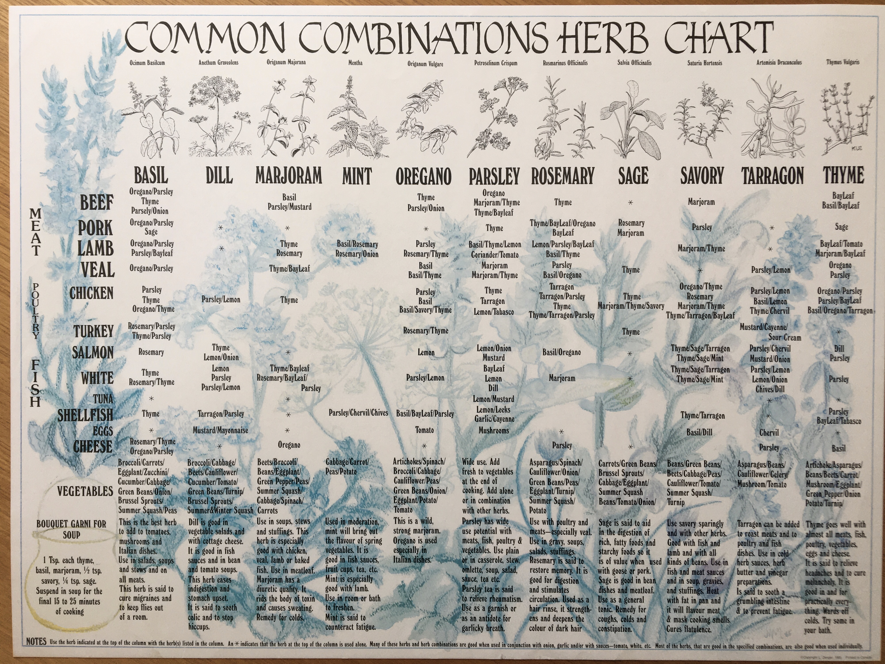

- discovering [the fascinating object system of the Io programming language](https://iolanguage.org/guide/guide.html#Objects) #[[object-oriented programming]] #Io #PL
- via Fosskers, [a useful vintage chart of culinary herbs and their common combinations](https://www.fosskers.ca/en/blog/herbs) #cooking
	- 
- Steve Klabnik on [Deleuze for developers](https://steveklabnik.com/writing/deleuze-for-developers-assemblages) ([2](https://steveklabnik.com/writing/deleuze-for-developers-deterritorialization), [3](https://steveklabnik.com/writing/deleuze-for-developers-will-smooth-spaceopen-source-suffice-to-save-us/)) #[[software engineering]] #Deleuze #assemblages #deterritorialization #philosophy #metaphysics