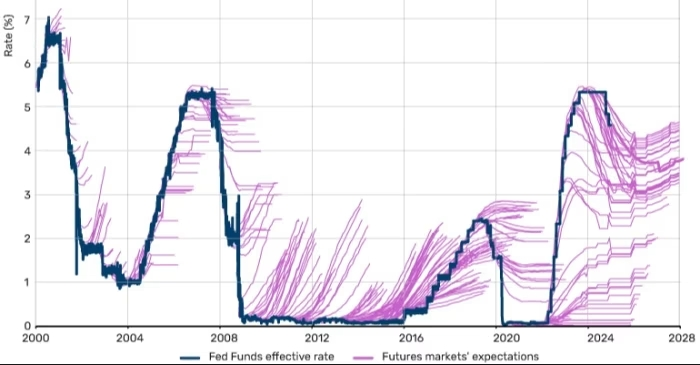

- via Financial Times, [Never ever make a prediction](https://www.ft.com/content/3e928a47-a6f0-4e0a-9bb4-3e7dbc749ece). featuring this fun graph of estimated fed rate expectations versus the actual fed rate: #economics #banking #[[Federal Reserve]]
	- 
- via SciAm, [why does the human brain operate at only 10 bits per second?](https://www.scientificamerican.com/article/the-human-brain-operates-at-a-stunningly-slow-pace/) #neurology #brain #cogsci
- [OpenAI's o3 scores a massive breakthrough on the ARC-AGI benchmark](https://arcprize.org/blog/oai-o3-pub-breakthrough) #ml #AI #OpenAI