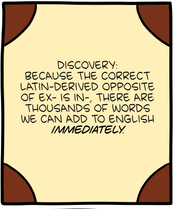

- [Explaining Deleuze with drum machines](https://www.youtube.com/watch?v=iDVKrbM5MIQ) - on the evolution of the drum machine as an explanation of arborescent vs. rhizomatic and tracing vs. mapping #philosophy #music #Deleuze #representation
- [Language Log and SMBC on word formation](https://languagelog.ldc.upenn.edu/nll/?p=67447) #linguistics #humor #english #latin
	- {:height 277, :width 225}