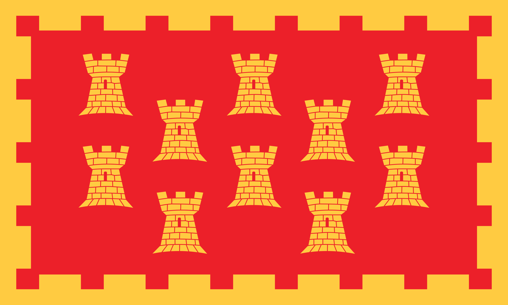
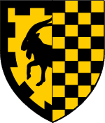
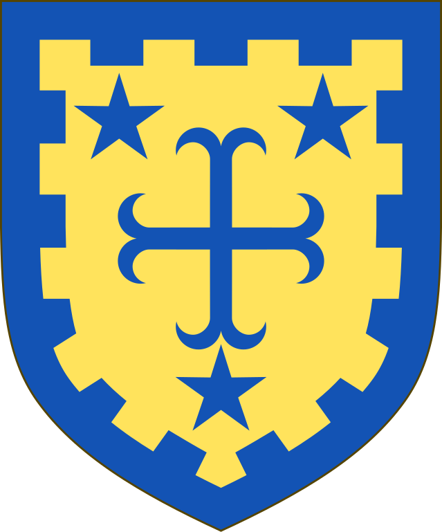

- [DeepSeek R1 is released](https://api-docs.deepseek.com/news/news250120), an open-source model on par with o1 #AI #ml #[[open source]] #China #DeepSeek
	- apparently, the model was trained with drastically lower compute requirements than competing models.
- on a kick with bicolor heraldic and vexillological designs: #heraldry #vexillology
	- the (unofficial) flag of Greater Manchester: #UK
		- {:height 282, :width 455}
	- the arms of Cabrera-Urgell:
		- 
	- the arms of Robin Ian Evelyn Milne Stuart de la Lanne-Mirrlees:
		- {:height 379, :width 307}