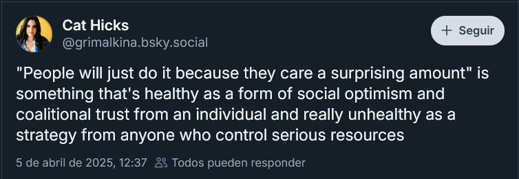

- via Cat Hicks on bsky, [some good advice on spontaneous self-organizing and its limits](https://bsky.app/profile/grimalkina.bsky.social/post/3lm3ej33mgk2x): #sociology #organization #trust
	- 
- [Meta releases Llama 4](https://ai.meta.com/blog/llama-4-multimodal-intelligence/) #AI #LLM #ml