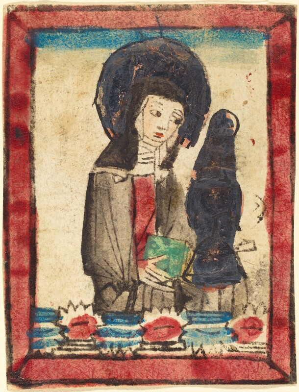

- Warren S. McCulloch's (one of the earlies pioneers of [[neural network]]s!) curiously excellent and interdisciplinary 1960 Alfred Korzybski Memorial Lecture, ["What Is a Number, that a Man May Know It, and a Man, that He May Know a Number?"](https://www.nsl.com/k/parry/mcculloch_what-is-a-number.pdf) #epistemology #psychology #[[philosophy of science]] #[[history of philosophy]] #[[philosophy of mind]] #[[philosophy of mathematics]] #psychology #logic #neuroscience
- via the Grauniad, [Harvard hired a researcher to uncover its ties to slavery. He says the results cost him his job: ‘We found too many slaves’](https://www.theguardian.com/news/2025/jun/21/harvard-slavery-decendants-of-the-enslaved) #[[higher education]] #Harvard #history #USA #slavery #race
- via [the National Gallery of Art](https://www.nga.gov/artworks/3814-saint-clare-assisi), this lovely 15th-century woodcut of Saint Clare #art #woodcut #[[Saint Clare of Assisi]] #Christianity
	- {:height 637, :width 479}