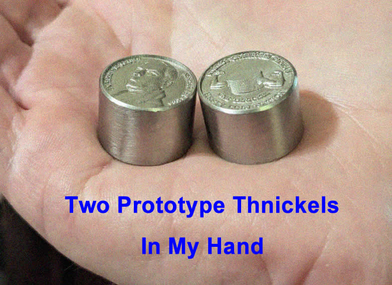

- introducing [the Thnickel](thick-coins.net)— for when regular coins just aren't hefty enough! #humor #numismatics
	- {:height 368, :width 515}
- Mario Zechner on [taming agentic engineering](https://mariozechner.at/posts/2025-06-02-prompts-are-code/). Mario suggests treating the LLM as a "shitty general purpose computer", then thinking of the prompt as your program, and provides an example of how to do this in practice. Mario suggests representing state in durable JSON or markdown files rather than trusting it to remain in context when relevant. #AI #[[software engineering]] #[[AI coding assistants]]