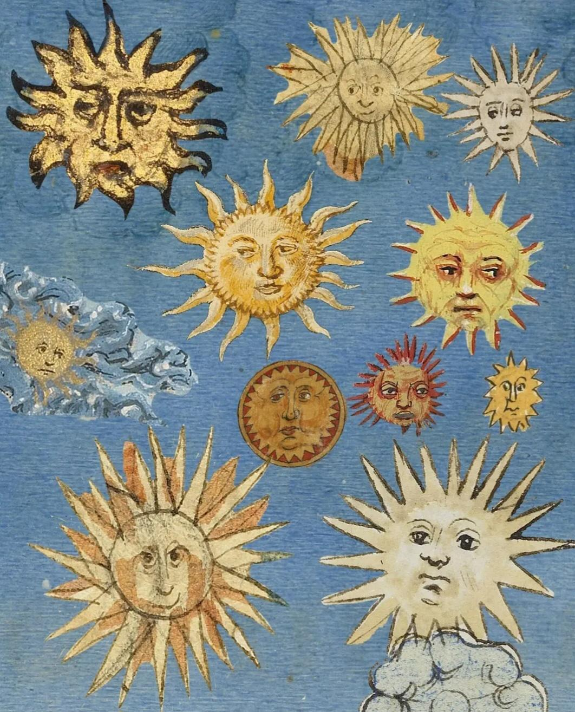
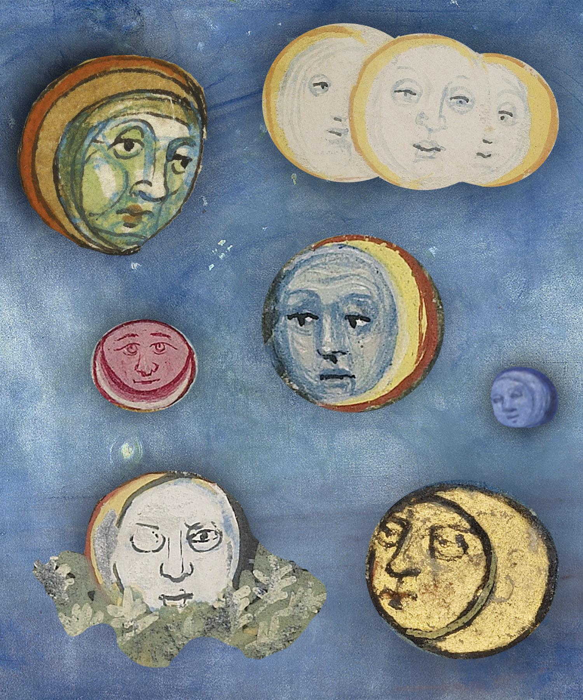
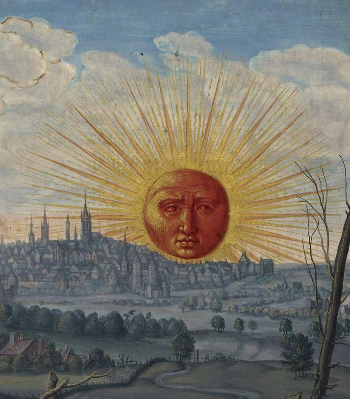

- via Reddit ([1](https://www.reddit.com/r/MedievalCreatures/comments/1lyp0l9/heres_some_sunshine_to_brighten_up_your_sunday/), [2](https://www.reddit.com/r/MedievalCreatures/comments/1lz0vc8/and_now_here_are_some_moons_to_wind_down_your/), [3](https://www.reddit.com/r/MedievalCreatures/comments/1l5i2yh/good_morning/)), some medieval suns and moons for the week! #art #medieval #illumination
	- {:height 551, :width 437}
	- {:height 530, :width 436}
	- {:height 501, :width 435}