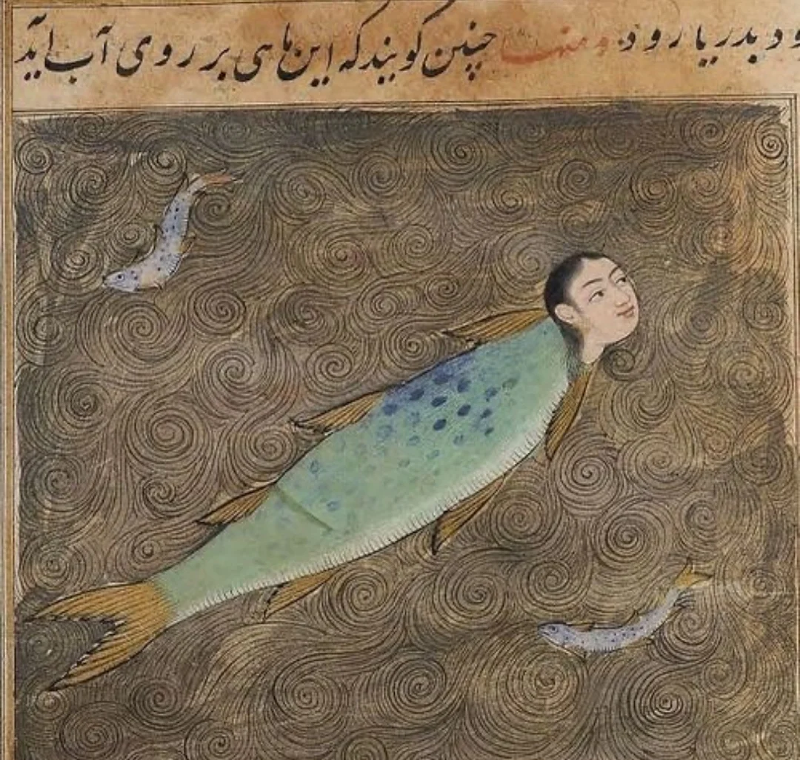

- [The Red and the Black](https://jacobin.com/2012/12/the-red-and-the-black/) - Jacobin tries to imagine a capital market post-capitalism #[[political economy]] #finance #capitalism #socialism
- a Persian 14th-century mermaid, from Zakaryya al-Qazwini's "The Wonders of Creation" #art #medieval #weirdmedievalguys
	- {:height 485, :width 499}