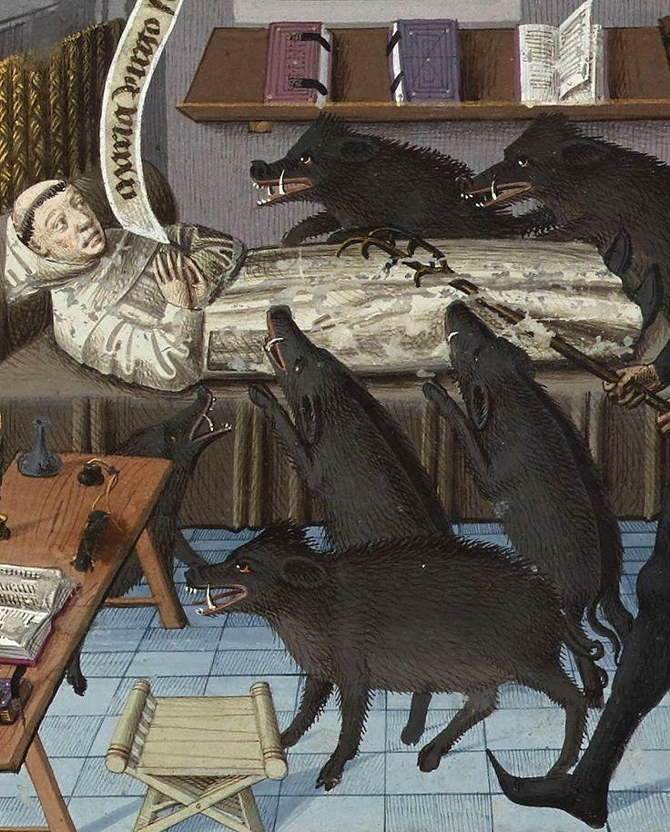

- via Bryan Maniotakis, [How I approach motion in product design](https://bryanmanio.com/blog/how-i-approach-motion-in-product-design/) #design #product #motion #animation
- [via Reddit](https://www.reddit.com/r/MedievalCreatures/comments/1ngp5gz/pig_attack/), that feel when you get attacked by 40 to 50 feral hogs in your bed, from *Speculum historiae*: #art #medieval #illumination
	- {:height 479, :width 381}