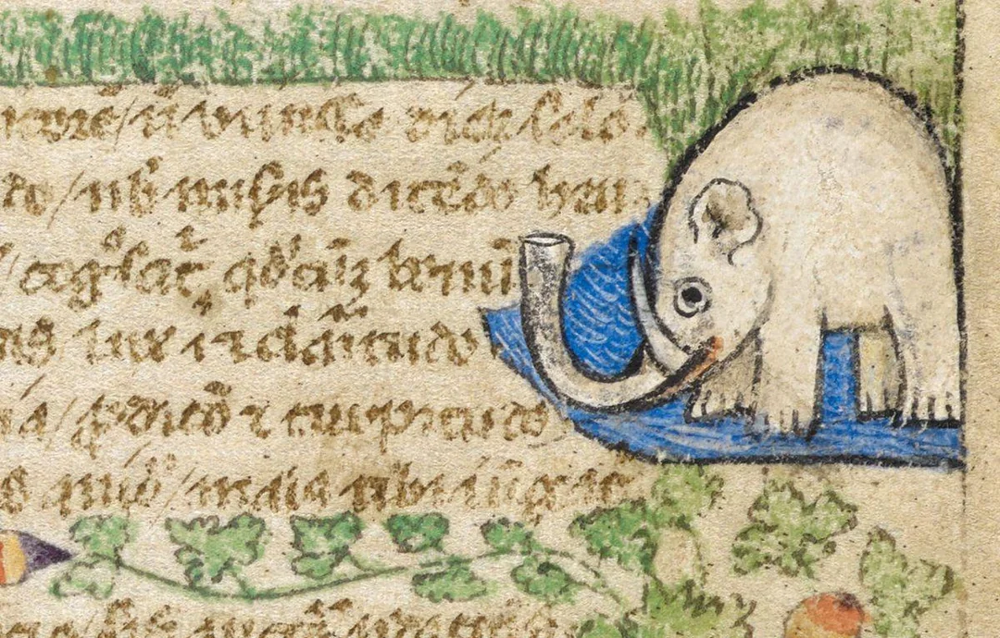

- via NYT, [Happy Birthday, LIGO - Now Drop Dead](https://www.nytimes.com/2025/09/10/science/gravitational-waves-ligo-black-holes.html). on the interesting history of observing gravitational waves #physics #gravity #engineering #Hawking
- via Reddit, [this fine medieval oliphaunt](https://www.reddit.com/r/MedievalCreatures/comments/1mugxnd/look_at_this_cute_medieval_elephant/) from "A Treatise on the Virtues and Vices" #illumination #medieval #weirdmedievalguys #elephant #art
	- 