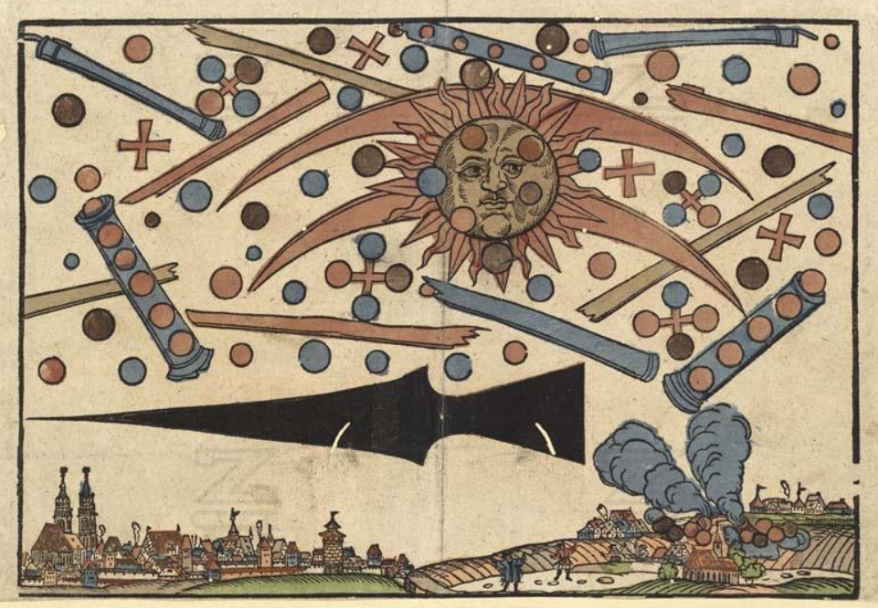

- via Dan Abramov, [Open Social](https://overreacted.io/open-social/) #AtProto #[[social media]] #[[software engineering]] #[[software architecture]] #[[open source]] #distsys
- windytan on the [sound of dialup, pictured](https://www.windytan.com/2012/11/the-sound-of-dialup-pictured.html) #internet #dialup #networking #[[history of technology]] #dsp
- via Reddit, [the Nuremberg apparition of 1561](https://www.reddit.com/r/MedievalCreatures/comments/1n2mc44/in_the_morning_of_april_14th_1561_a_dreadful) #Renaissance #illumination #art
	- {:height 502, :width 713}