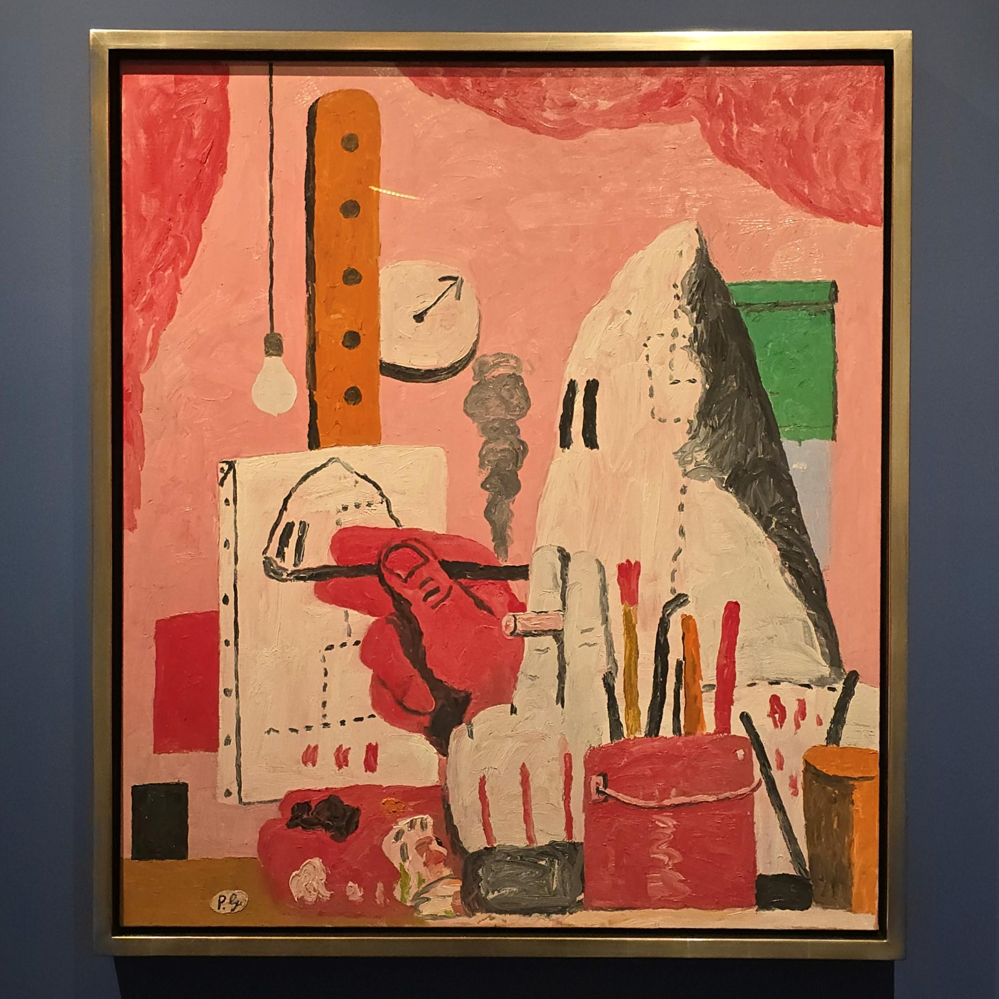

- Theia Vogel on [why LLMs freak out over the seahorse emoji](https://vgel.me/posts/seahorse/), using the logit lens. #AI #LLM #explainability
	- more from Theia, [Representation engineering Mistral-7B an acid trip](https://vgel.me/posts/representation-engineering/)
- Simon Willison on [embracing the parallel coding agent lifestyle](https://simonwillison.net/2025/Oct/5/parallel-coding-agents/) #AI #LLM #[[AI coding assistants]] #[[developer tooling]] #[[developer experience]]
- Philip Guston - The Studio #art #[[Philip Guston]]
	- {:height 581, :width 574}