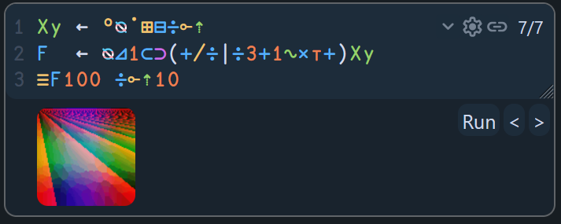

- learned of [Uiua](https://www.uiua.org/), a particularly delightful little language. it's both array-oriented and stack-based, and looks wild! #PL #[[software engineering]] #[[stack-based programming]] #[[array-oriented programming]] #Uiua
	- 