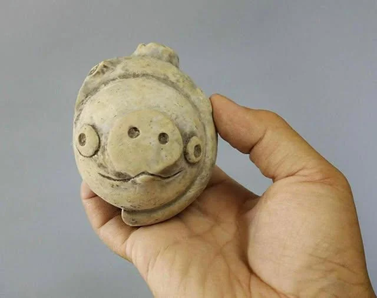

- [via Reddit](https://www.reddit.com/r/MedievalCreatures/comments/1o34hlm/premedieval_a_3000yearold_clay_pig_discovered_at/), a thoroughly delightful ancient Chinese stone pig! #weirdmedievalguys #art #sculpture #China #ancient
	- 