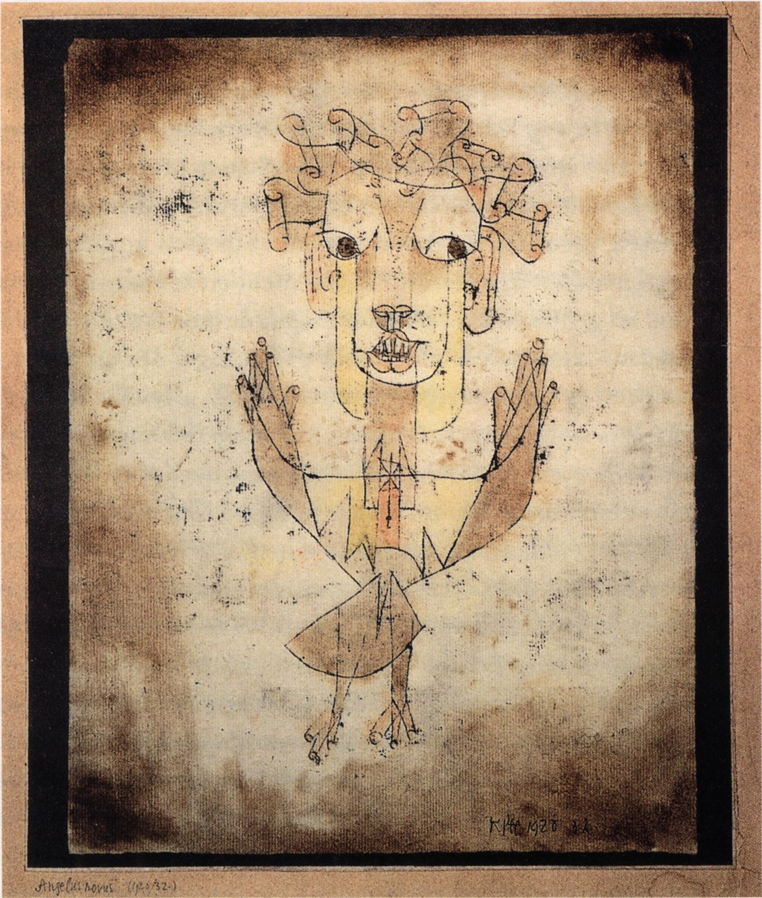

- Paul Klee's "Angelus Novus" #art #Klee
	- {:height 418, :width 343}
- [‘I was living in Doodle Land and didn’t know how to get back’: the million-dollar artist who drew himself crazy](https://www.theguardian.com/artanddesign/2025/jun/28/mr-doodle-sam-cox-psychosis-mental-health-interview) #art #UK #biography #[[mental illness]]
- via Building a Ruin, [In Memory of Janos Kornai: The Contradictions of a Surplus Economy](https://building-a-ruin.ghost.io/in-memory-of-janos-kornai/) #Kornai #economics #socialism #[[Soviet bloc]] #Hungary