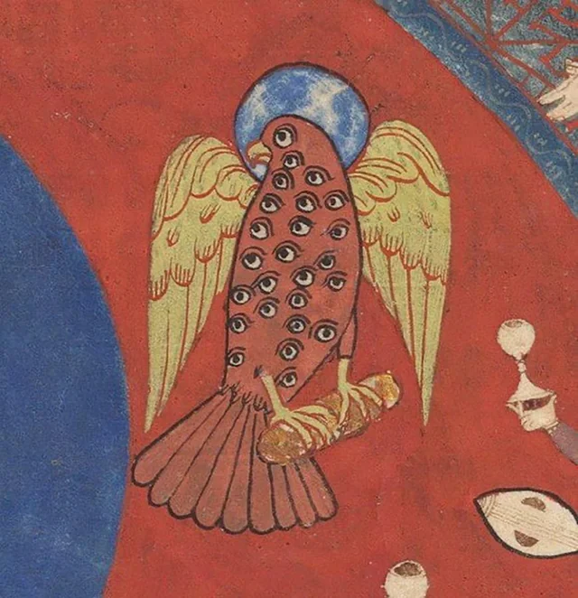

- [via Reddit](https://www.reddit.com/r/MedievalCreatures/comments/1okqz5w/where_we_go_we_wont_need_eyes_to_see/), this rather alarming critter from the Saint-Sever Beatus. talk about 20/20/20/20/20/20 vision #art #illumination #medieval #birds #weirdmedievalguys #France
	- {:height 377, :width 357}
- Yesenia Perez-Cruz on [product primitives](https://yeseniaperezcruz.substack.com/p/when-the-output-becomes-the-material) #[[design system]] #web #frontend #design
	- > The Control Center is built for quick changes to common settings. It’s visual, tactile, and concise. Each setting uses icons and shapes that match its purpose. System Settings handles more detailed configurations. It’s dense and uses utilitarian controls with clear explanations.
	  What you don’t see is a middle ground: a collection of cards with generic sliders and toggles. When design teams end up with solutions that feel vague or generic, it’s usually because they started with the component instead of the user’s goal.
	- related, TJ Pitre on [context-based design systems](https://southleft.com/insights/design-systems/context-based-design-systems-a-new-model-for-the-ai-driven-product-lifecycle/) #AI #[[design system]] #linting #[[AI coding assistants]]
- ['Self-termination is most likely'](https://www.theguardian.com/environment/2025/aug/02/self-termination-history-and-future-of-societal-collapse)- the Grauniad on Luke Kemp's *Goliath's Curse* and the history of societal collapses #history #collapse #sociology
	- > Goliath states do not simply emerge as dominant cliques that loot surplus food and resources, he argues, but need three specific types of “Goliath fuel”. The first is a particular type of surplus food: grain. That can be “seen, stolen and stored”, Kemp says, unlike perishable foods. [...]
	  The second Goliath fuel is weaponry monopolised by one group. Bronze swords and axes were far superior to stone and wooden axes, and the first Goliaths in Mesopotamia followed their development, he says. Kemp calls the final Goliath fuel “caged land”, meaning places where oceans, rivers, deserts and mountains meant people could not simply migrate away from rising tyrants. Early Egyptians, trapped between the Red Sea and the Nile, fell prey to the pharaohs, for example.
	  “History is best told as a story of organised crime,” Kemp says. “It is one group creating a monopoly on resources through the use of violence over a certain territory and population.”