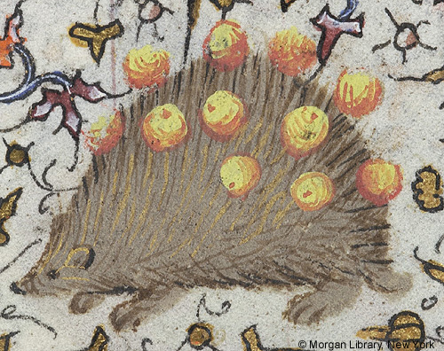

- learned about [Bubble Tea](https://github.com/charmbracelet/bubbletea), a neat Elm-inspired TUI framework for Go #CLI #Go #Elm #[[software engineering]]
- [Vintersorg's latest](https://hammerheart.bandcamp.com/album/vattenkrafternas-spel) is a rather enjoyable melodic-folk-prog-black-metal stew #meloblack #[[prog metal]] #[[folk metal]] #music #Sweden
- from the Hours of Charlotte of Savoy, a medieval porcupine stuck full of fruit! #weirdmedievalguys #art #illumination #porcupine #animals #medieval
	- 