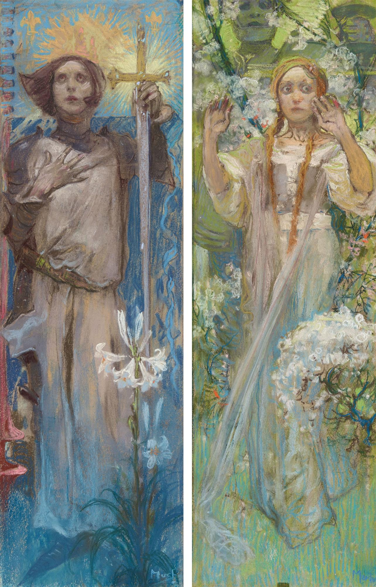

- via Rob Zolkos, [CSS Is All You Need](https://www.zolkos.com/2025/12/03/vanilla-css-is-all-you-need)- exploring some lovely modern CSS features like `:has()`, through the no-build codebase of 37signals #CSS #web #frontend #37signals
	- related, [a past deep-dive from Jason Zimdars](https://dev.37signals.com/modern-css-patterns-and-techniques-in-campfire/)
	- and Cassidoo's [what, how, and why of CSS Clamp](https://cassidoo.co/post/css-clamp/)
- [We Can Change the Defaults](https://spui25.nl/programma/we-can-change-the-defaults-building-networks-of-consent-and-spaces-of-joy-in-the-ruins-of-social-media) - Christine Lemmer-Webber on ActivityPub, the Spritely Institute, and whether another future is possible for social media #[[software engineering]] #talks #ActivityPub #[[social media]]
- Alphonse Mucha's Joan of Arc #art #France #Mucha #[[art nouveau]]
	- {:height 880, :width 560}