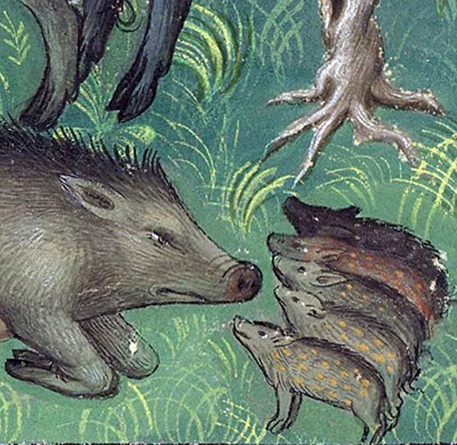

- via Liberal Currents, [They Were All Our Ancestors](https://www.liberalcurrents.com/they-were-all-our-ancestors/): "Nationalism chooses sides in the most awful family drama of all time. It sides with the evildoers, and never with their victims, and teaches you to do the same." #history #liberalism #nationalism #Rousseau #[[social contract theory]] #[[political philosophy]] #Europe
- from [Morgan, MS M. 1044, fol. 20v](https://ica.themorgan.org/manuscript/page/11/77121), a boar family! #art #medieval #illumination #animals #boars
	- {:height 381, :width 380}