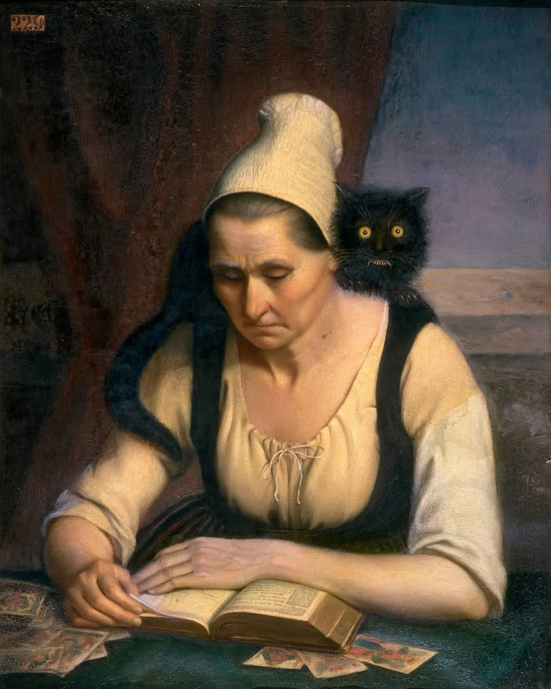
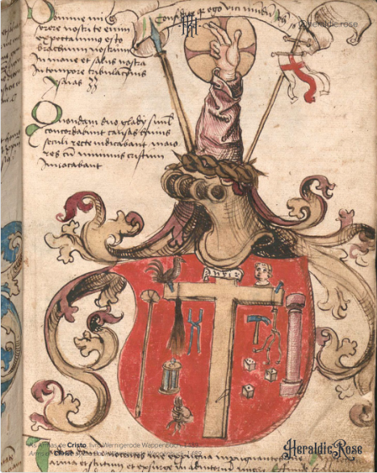

- Clementine Dondey's "Fortune teller studying a book of necromancy", featuring a high-quality cat: #art #[[Clementine Dondey]] #cats
	- {:height 539, :width 425}
- for this Christmas Eve, the purported arms of Jesus Christ from the Wernigerode Wappenbuch #heraldry #art #medieval #Christianity
	- 