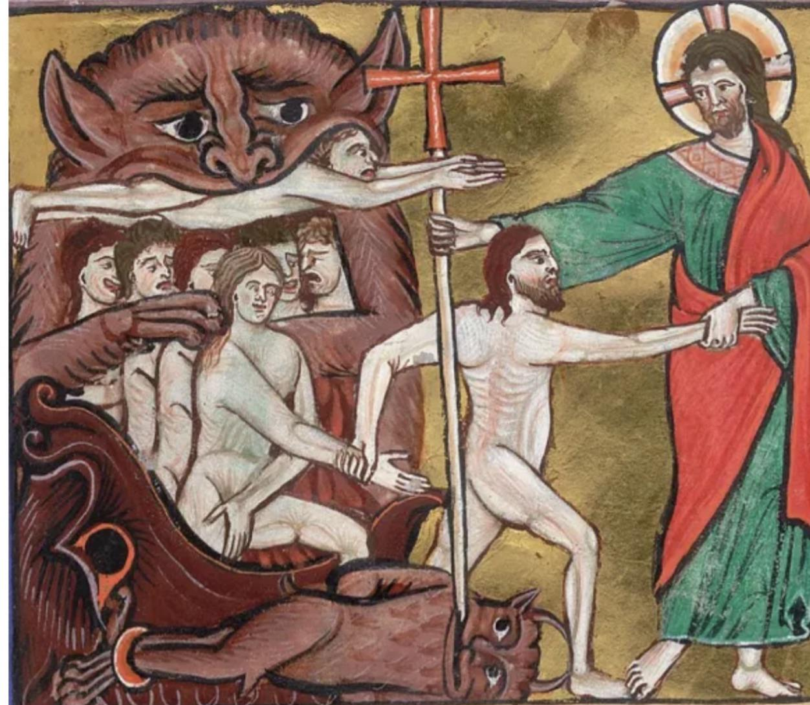

- via Futurism, [Alzheimer's has been fully reversed in a mouse model](https://futurism.com/health-medicine/alzheimers-mice-cured) #medicine #dementia
- AI Futures, previously of AI 2027 fame, [updates their timeline](https://blog.ai-futures.org/p/ai-futures-model-dec-2025-update) - with a significantly more pessimistic timeline #AI #futurism
	- the model itself: https://www.aifuturesmodel.com/
	- previously: ((67ee0efb-ec90-4c61-8663-55db6ffede89))
- from [the Arundel Psalter](https://iiif.biblissima.fr/collections/manifest/7a53bf8255e3b19c65cdac1635ff47b33514495e), some guys escaping fate as an afternoon snack #weirdmedievalguys #illumination #art #Catholicism #medieval
	- {:height 432, :width 486}