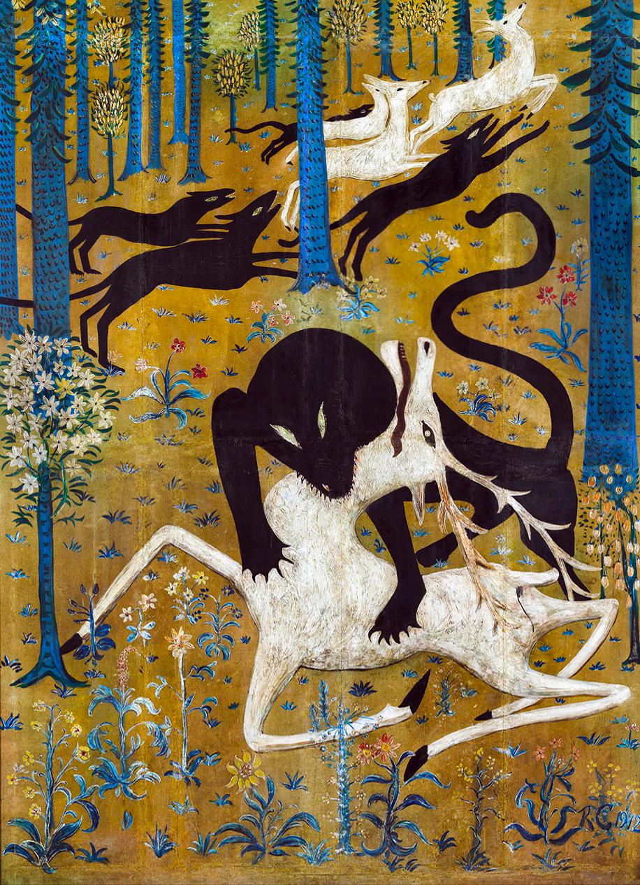

- Rachit Nigam argues, ["transpiler" is a useless word](https://people.csail.mit.edu/rachit/post/transpiler-formal/) #compilers #PL #transpilers #compsci
- Michelle Ma [on Journavx](https://www.worksinprogress.news/p/the-first-non-opioid-painkiller), the first competitive non-opioid painkiller #medicine #painkillers #biochem #[[drug discovery]]
- Robert W. Chanler's *Leopard and Deer* #art #deer #leopards #[[Robert W. Chanler]]
	- {:height 623, :width 446}
- reflection on last year's New Years: #[[new years]]
	- ((677eb322-3dd4-40b1-ba83-d7a02e082a3d))
	- half-baked it. hit about 50% on a lot of them, and crushed the educational goal.
	- for next year, think harder about which things are enduring and which are fleeting interests.
	- i'm doing real bad at reading! need to set aside time each week specifically for that.
- 2026 New Years projects, methinks: #[[new years]]
	- reading: complete at least 6 books related to my career and areas of technical interest. write a bit about each
	- Spanish: read *Cien años de soledad*, in the original Spanish, by the end of the year
	- ed: continue my education. make steady progress in my master's and finish another Datacamp cert.
	- connection: write about one blog post per month. network in fields of interest. stay better in touch with friends