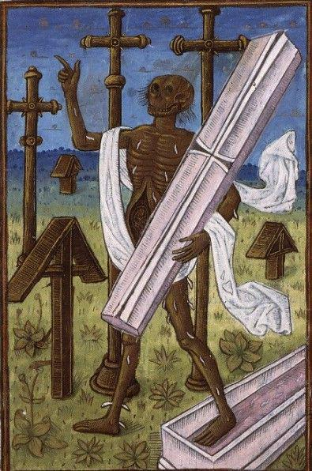

- [on how they fixed a typo in Street Fighter 2 with a human leg](https://www.youtube.com/watch?v=dUkLYOPRYH4) #video #gaming #debugging #[[software engineering]] #[[arcade games]] #[[history of technology]]
- CLJ on [Johann Baptist Metz and the Advent logic of class treason](https://churchlifejournal.nd.edu/articles/the-advent-logic-of-class-treason/) #[[Johann Baptist Metz]] #class #Catholicism #Christianity #poverty #theology #[[political economy]]
	- > *"Christian love in periods of nationalistic thinking may well have to incur the suspicion of harming the national honor. In situations of racism it will incur the suspicion of race treason. And in periods when the social contradictions in the world cry out to heaven it will incur the suspicion of class treason for betraying the allegedly necessary interests of the propertied. Did not Jesus himself incur the reproach of treason? Was he not crucified as a traitor?"*
	- > *"The bourgeois religion demands nothing, but it also fails utterly to console. God can indeed still be quoted in it, but no longer really adored. God’s grace does not break in, cast down, or raise up: it simply overarches, as a “value,” our bourgeois identity and becomes in this sense truly “cheap grace,” that very graciousness which we bourgeois preeminently bestow upon ourselves. And so, just as our bourgeois society provides less and less material for dreaming and poetry, our bourgeois religion itself supplies scarcely anything for mysticism and adoration, for resistance and conversion."*
- via [Angers, BM, impr. Rés. SA 3390](https://initiale.irht.cnrs.fr/en/codex/5740), this jolly dead fellow about to "🤓☝️ um, actually" you #art #illumination #death #weirdmedievalguys #medieval
	- 