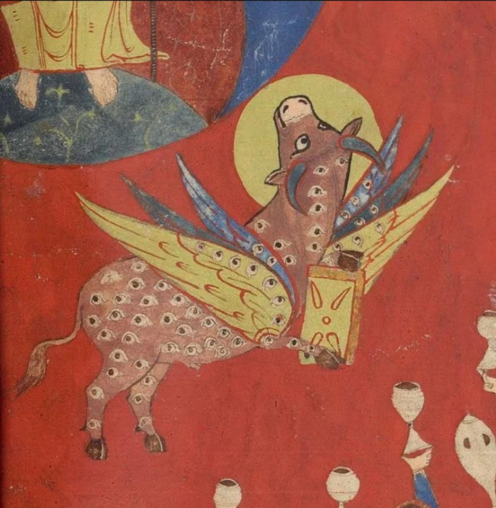

- learned about [papersin.systems](https://papersin.systems/), a journal club hosted by Ruth Malan to read systems thinking papers #papers #[[systems thinking]] #[[systems engineering]]
- John David Pressman [on varieties of doom](https://gist.github.com/JD-P/997abef66ec8ac0efcefe24bb1d19109) #AI #[[existential risk]] #collapse #futurism
- via the Saint-Sever Beatus, the fabled "holy cow" #art #illumination #cows #weirdmedievalguys #medieval
	- {:height 385, :width 367}