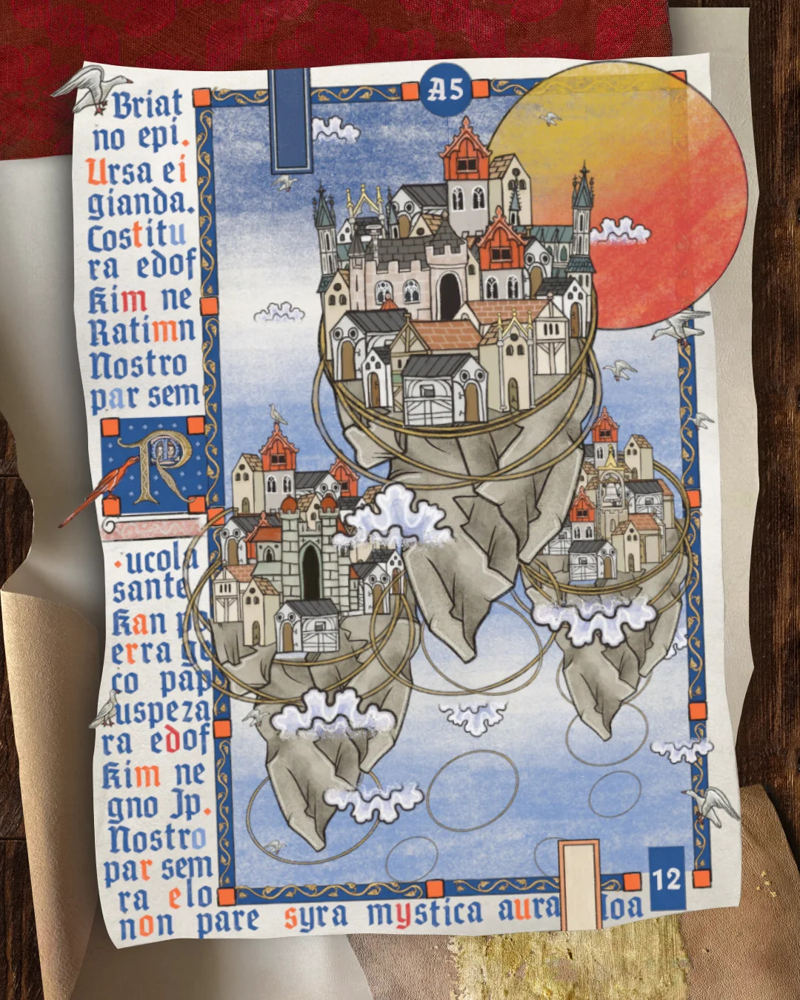

- buyukakyuz brings you, [corroded](https://github.com/buyukakyuz/corroded), the spiciest unsafe Rust library #Rust #[[software engineering]] #humor
- learned about [thepractitioner.cloud](https://thepractitioner.cloud/), a knowledgebase for platform engineering #[[platform engineering]] #[[software engineering]] #learning
- the create-pull-request repo has [these very nice notes on GHA concepts and guidelines](https://github.com/peter-evans/create-pull-request/blob/main/docs/concepts-guidelines.md) #GitHub #CICD #nuggets
- [via Reddit](https://www.reddit.com/r/medieval/comments/1p6eq6v/what_would_medieval_heaven_look_like_my_attempt/), this amazing attempt to create a medieval-style illuminated work: #illumination #art
	- {:height 545, :width 430}