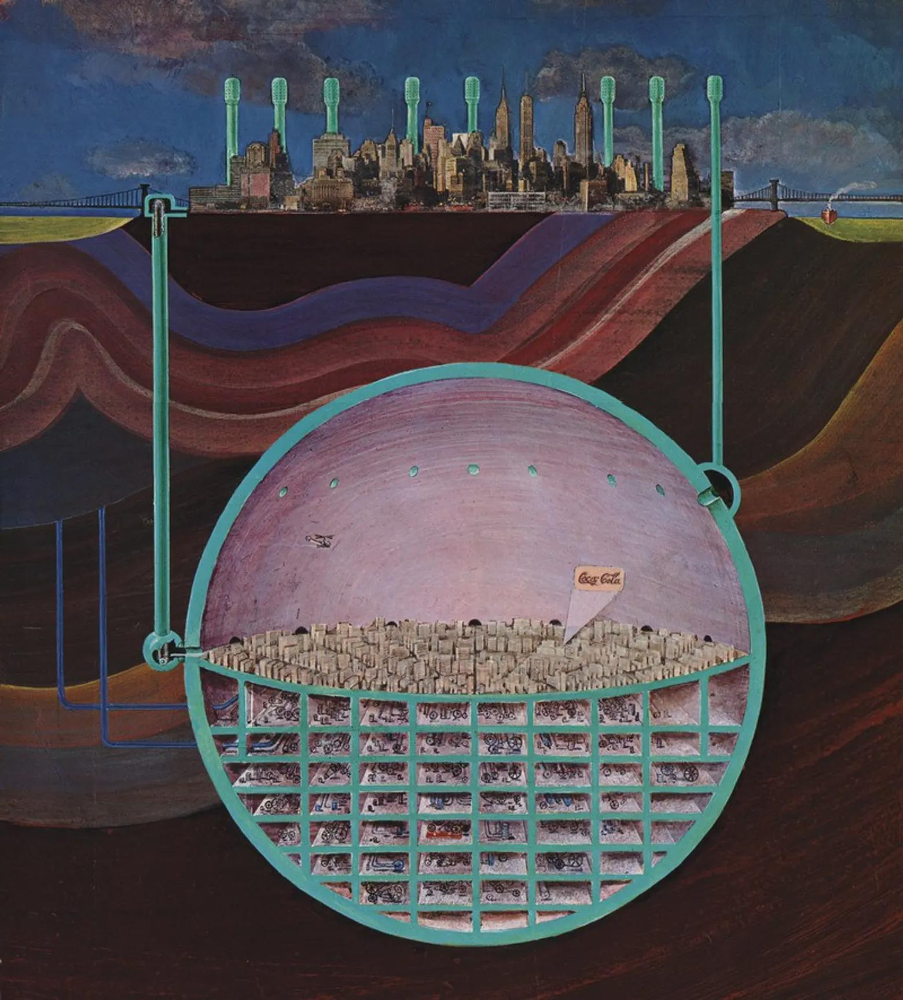

- some takes on why _not_ to use RAG #ml #RAG
	- Boris Cherny [on ditching RAG for agentic discovery](https://xcancel.com/pashmerepat/status/1926717705660375463) #Claude
	- Nik Pash on [why he no longer recommends RAG](https://pashpashpash.substack.com/p/why-i-no-longer-recommend-rag-for)
	- Nik Baumann on [why Cline doesn't index your codebase](https://cline.bot/blog/why-cline-doesnt-index-your-codebase-and-why-thats-a-good-thing) #Cline
- Oscar Newman's design for a nuke-proof underground city: #architecture #subterranean #futurism #art
	- {:height 601, :width 534}