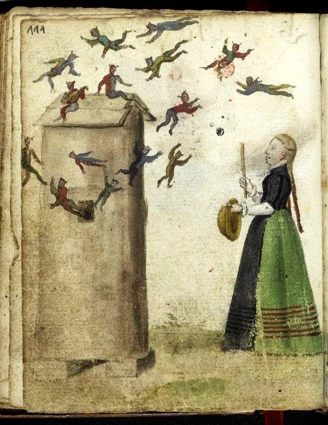

- learned about Tobi Lutke's [qmd](https://github.com/tobi/qmd), an easy pipeline for local RAG. i should play with this! #ml #RAG #LLM
- [via Reddit](https://www.reddit.com/r/MedievalCreatures/comments/1pt3u1n/gonna_need_a_bigger_thwackin_stick/), this illustration of tiny flying guys: #Renaissance #weirdmedievalguys #art
	- {:height 477, :width 364}