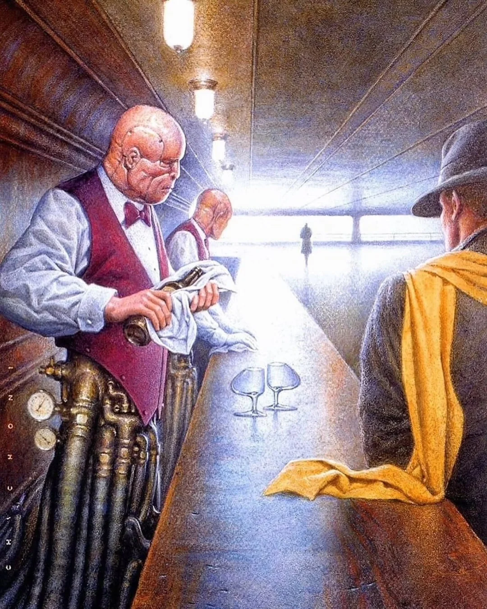
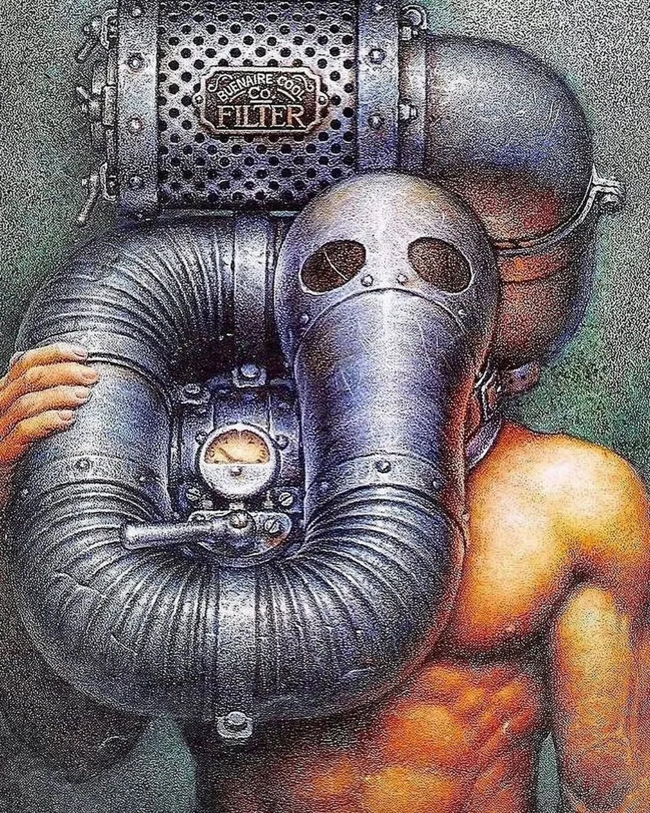

- Julian Sanchez [on "Chait Speech"](https://www.juliansanchez.com/2015/01/27/chait-speech/) and the discursive norms that lead to self-censorship #media #[[social media]] #[[free speech]] #conformity #sociology #ingroup
- [Wata Igarashi - Kaleidoscopic](https://wataigarashi.bandcamp.com/track/kaleidoscopic) #music #techno #Japan
- [via Reddit](https://www.reddit.com/r/argentina/comments/1r4l5nw/arte_de_oscar_chichoni_pintor_e_ilustrador_de/), the fantastic sci-fi art of Oscar Chichoni #art #sci-fi #comics #Argentina
	- {:height 414, :width 326}
	- {:height 408, :width 332}