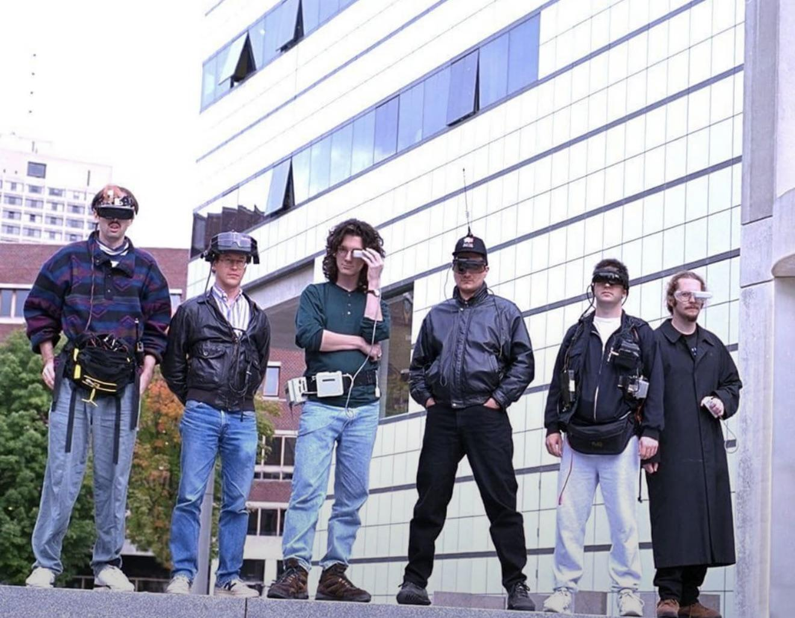

- Kevin Beaumont finds a massively common class of vuln being [propagated every day in real time by Claude](https://cyberplace.social/@GossiTheDog/116080909947754833) #AI #security #Claude
- Dan Kagan-Kans argues, [the left is missing out on AI](https://www.transformernews.ai/p/the-left-is-missing-out-on-ai-sanders-doctorow-bender-bores) #AI #polisci #sociology #left
- [via Reddit](https://www.reddit.com/r/OldSchoolCool/comments/11xjydi/members_of_the_wearable_computing_project_at_mit/), the unbelievably dripped-out MIT Wearable Computing Project in the 1990s #wearables #fashion #MIT #cyberpunk
	- {:height 430, :width 542}