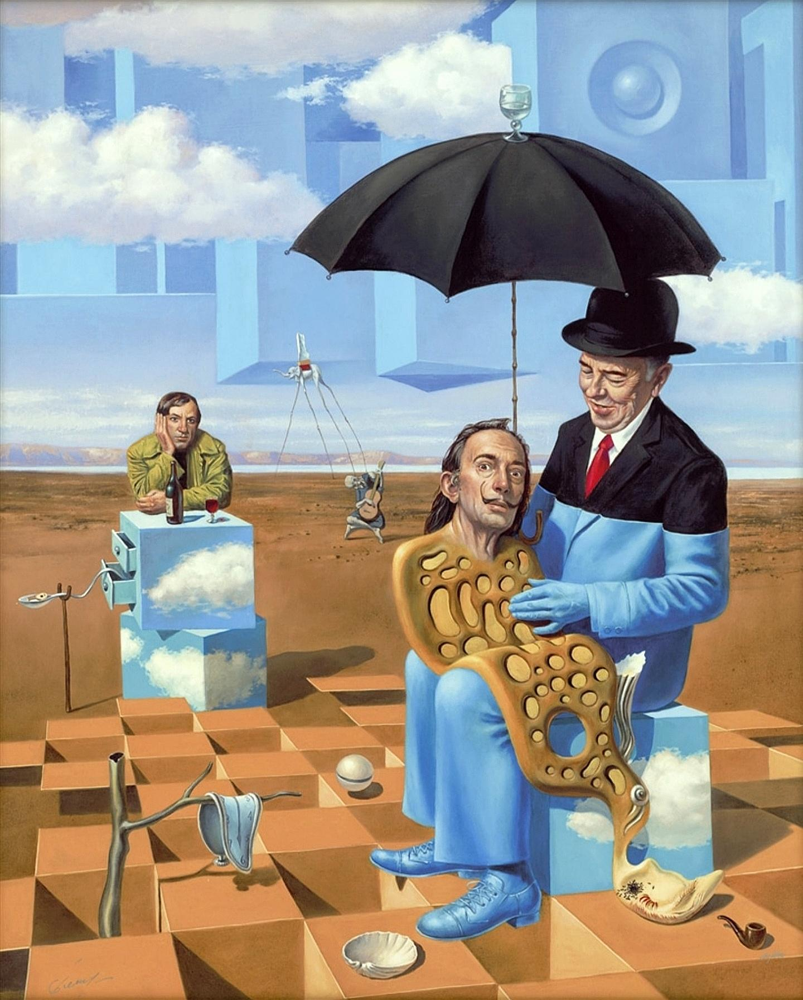

- [Lobsters interviews Steve Klabnik](https://lobste.rs/s/w1bsle/lobsters_interview_with_steveklabnik). some interesting stuff, including wisdom about managing open source, and the use of ADRs in personal projects #interviews #[[software engineering]] #Rust
	- tangentially, Klabnik on [the language strangeness budget](https://steveklabnik.com/writing/the-language-strangeness-budget/)
- learned about the [Good Regulator Theorem](https://en.wikipedia.org/wiki/Good_regulator_theorem) — "every good regulator of a system must be a model of that system" #cybernetics #homomorphism
- Michael Cheval's *Lullaby of Uncle Magritte* #art #surrealism #[[Michael Cheval]]
	- {:height 522, :width 419}