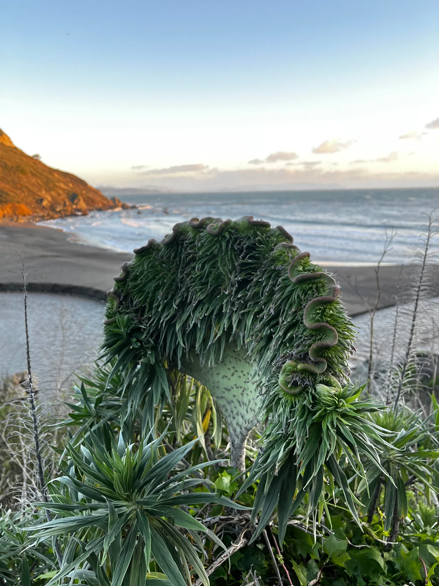

- Paul Frazee on [the practical decentralization of atproto](https://www.pfrazee.com/blog/practical-decentralization) #AtProto #decentralization #[[software architecture]] #[[social media]]
- OpenAI on [harness engineering](https://openai.com/index/harness-engineering/) #[[platform engineering]] #[[harness engineering]] #[[AI coding assistants]] #AI #OpenAI
- [via Reddit](https://www.reddit.com/r/fasciation/comments/1r9jdru/insane_fasciation_on_a_pride_of_madeira_echium/), this wildly fasciated Pride of Madeira #plants #biology #fasciation
	- {:height 566, :width 416}
- Caleb Leak [taught his dog to vibecode](https://www.calebleak.com/posts/dog-game/) #humor #LLM #AI #vibecoding #[[AI coding assistants]] #dogs